# AI Brand Identity Creator — Product and Technical Plan

**Project directory:** `brand-identy-v3`  
**Document status:** Implementation-ready planning draft  
**Last updated:** 2026-07-19  
**Frontend:** Next.js + TypeScript  
**Backend:** NestJS + TypeORM  
**Database:** PostgreSQL  
**AI gateway:** OpenRouter  

---

## 1. Product summary

The Brand Identity Creator is a module that can be embedded inside a larger product. It guides a user from a plain-language business description to an editable, versioned brand identity.

The user journey has four working stages and one finalization stage:

1. **Brief** — understand the business and structure the initial description.
2. **Strategy** — turn the approved brief into a complete brand strategy.
3. **Visuals** — create editable visual directions, color systems, typography, and previews.
4. **Assets** — generate logo concepts and manage uploaded/generated brand assets.
5. **Finalize** — compile design tokens and a brand book, approve the identity, and activate a version.

AI output is never treated as an uneditable final answer. Every generated field can be edited, cleared, or completed manually. Every generation is recorded so outputs are reproducible, auditable, and attributable to a prompt/model version.

---

## 2. Goals

- Accept an open-ended business description in any supported language.
- Generate a structured brief containing:
  - industry;
  - languages;
  - target audiences;
  - markets;
  - products/services;
  - current or desired positioning;
  - visual/brand preferences;
  - business, legal, cultural, or technical constraints.
- Allow manual entry before generation and editing after generation.
- Generate a strategy containing:
  - positioning;
  - value proposition;
  - mission;
  - vision;
  - values;
  - personas;
  - messaging pillars;
  - taglines;
  - brand voice and usage rules.
- Generate multiple visual directions after the brief and strategy meet completion requirements.
- Generate and manage logo concepts and other brand assets.
- Publish approved assets through a public brand-asset CDN and accept controlled anonymous uploads without requiring a user account.
- Show visual results in galleries in the Visuals and Assets stages.
- Compile deterministic design tokens and an exportable brand book.
- Support draft, approval, activation, and later identity versions.
- Include first-party user, authentication, session, workspace, membership, and invitation modules.
- Integrate with a parent product through an optional external `parentProjectId` and events without depending on the parent for authentication.

---

## 3. Non-goals for the first release

- Automatic trademark clearance or legal approval of names/logos.
- Claiming that an AI-generated raster logo is production-ready vector artwork.
- Full vector editing comparable to Figma or Illustrator.
- Printing, fulfillment, or domain registration.
- Training a custom model on customer data.
- Real-time multi-user editing. Optimistic concurrency is sufficient for v1.

---

## 4. Users, authentication, workspaces, and parent-project integration

This project owns its user and authentication lifecycle. The parent project is an optional integration, not the authentication source of truth.

### 4.1 User module

The User module supports:

- registration with email and password;
- unique, case-insensitive normalized email addresses;
- email verification;
- profile fields: display name, avatar URL, preferred locale, and timezone;
- account status: pending verification, active, suspended, or deleted;
- profile editing and password change;
- soft account deletion and session revocation;
- optional external OAuth identities without changing the core user record;
- administrative suspension/reactivation with an audit record.

### 4.2 Authentication module

The Auth module supports:

- email/password login;
- password hashing with Argon2id;
- short-lived signed access JWTs (recommended 10–15 minutes);
- opaque rotating refresh tokens stored only as hashes;
- server-tracked sessions per browser/device;
- logout from the current session and logout from all sessions;
- email verification and password-reset flows using single-use hashed tokens;
- refresh-token replay detection: reusing a rotated token revokes that session family;
- optional OAuth/OIDC providers through `auth_identities`;
- rate limiting and generic login/reset responses to reduce account enumeration;
- optional MFA as a later extension; MFA is not required for the initial release.

Access tokens contain only stable authorization context: `sub` (user ID), `sid` (session ID), issuer, audience, and expiry. Workspace role is loaded from current membership data so a stale token cannot preserve removed workspace access.

### 4.3 Workspace ownership and membership

- Every registered user receives or creates a workspace during onboarding.
- A user can belong to multiple workspaces.
- `workspace_memberships` is the source of truth for `OWNER`, `EDITOR`, `REVIEWER`, and `VIEWER` roles.
- The active workspace is explicit in the route/header and must match a live membership.
- Removing a membership immediately blocks new API access to that workspace.
- The last owner cannot leave or be removed until ownership is transferred or the workspace is deleted.
- Invitations are single-use, expiring, and stored as token hashes.

### 4.4 Parent-project integration

`identity_projects.parent_project_id` remains an optional external UUID. It links an identity to the enclosing product but has no database foreign key because the external project may have a separate lifecycle or database.

The authenticated request context contains:

- `actorUserId` — from the validated session/access token;
- `sessionId` — used for revocation/security checks;
- `workspaceId` — selected workspace after membership validation;
- `workspaceRole` — current role from `workspace_memberships`;
- `parentProjectId` — optional external integration ID.

Recommended permission mapping:

| Action | Owner | Editor | Reviewer | Viewer |
|---|---:|---:|---:|---:|
| Create identity project | Yes | Yes | No | No |
| Edit brief/strategy/visuals | Yes | Yes | Comment only | No |
| Generate AI outputs | Yes | Yes | No | No |
| Upload/manage assets | Yes | Yes | No | No |
| Submit for approval | Yes | Yes | No | No |
| Approve/reject | Yes | No | Yes | No |
| Activate version | Yes | No | Optional | No |
| View/export approved brand book | Yes | Yes | Yes | Yes |

Integration events emitted by this module:

- `user.registered`
- `user.email_verified`
- `user.account.suspended`
- `workspace.created`
- `workspace.member.added`
- `workspace.member.role_changed`
- `workspace.member.removed`
- `brand_identity.project.created`
- `brand_identity.version.created`
- `brand_identity.stage.completed`
- `brand_identity.version.submitted`
- `brand_identity.version.approved`
- `brand_identity.version.rejected`
- `brand_identity.version.activated`
- `brand_identity.brand_book.exported`

Each event must include `eventId`, `occurredAt`, `workspaceId`, `parentProjectId`, `identityProjectId`, `identityVersionId`, `actorUserId`, and a small event-specific payload.

---

## 5. Core UX and workflow

### 5.1 Entry screen

The first screen contains:

- project/brand working name (optional);
- one large textarea: “Describe the business you want to create a brand identity for”;
- example prompts;
- preferred response language;
- `Build my brief` primary button;
- `Start manually` secondary action.

Example input:

> We are launching a bilingual Arabic/English premium meal-planning service in Egypt for busy professionals. It should feel modern and warm, not clinical. We offer subscriptions and one-off consultations. Avoid green wellness clichés.

When submitted:

1. Create an identity project and its first draft version.
2. Store the original description unchanged.
3. Enqueue a `BRIEF_EXTRACT` generation job.
4. Navigate to the workspace and show field-level skeleton states.
5. Validate the structured response before saving it.
6. Populate the Brief form and highlight AI-suggested fields.

### 5.2 Workspace layout

Recommended desktop layout:

- Left: vertical stage navigation (`Brief`, `Strategy`, `Visuals`, `Assets`, `Finalize`).
- Center: editable form or selected preview.
- Right: completion checklist, AI job status, warnings, and generation history.
- Top bar: brand name, version selector, save state, collaborators/role, overflow menu.
- Bottom sticky action area: stage-specific primary action.

Recommended mobile layout:

- Stage navigation becomes a horizontal stepper.
- Forms and preview gallery stack vertically.
- Sticky action remains visible.

### 5.3 Stage state model

Each stage has one of these states:

- `LOCKED` — prerequisites have not been satisfied.
- `NOT_STARTED` — available but empty.
- `GENERATING` — an AI or compilation job is active.
- `NEEDS_INPUT` — partially complete or validation failed.
- `READY` — required fields are complete.
- `COMPLETED` — user explicitly confirmed the stage.
- `STALE` — an upstream confirmed stage changed after this output was generated.
- `FAILED` — latest job failed; manual editing and retry remain available.

State transition rules:

```text
Brief READY -> user confirms -> Brief COMPLETED -> Strategy unlocked
Strategy READY -> user confirms -> Strategy COMPLETED -> Visuals unlocked
Brief/Strategy changes after Visuals -> Visuals and downstream stages become STALE
Visual direction selected -> Assets unlocked
At least one approved/selected logo -> Finalize prerequisites satisfied
Approved version -> may be activated
Only one active version per identity project
```

“Stale” does not delete existing work. It warns the user, preserves the prior result, and offers regeneration.

### 5.4 Autosave and conflict behavior

- Debounce field autosave by 600–1000 ms.
- Save explicit list operations immediately.
- Every editable aggregate has an integer `lock_version`.
- API update requests send the last known `lockVersion`.
- A mismatch returns HTTP `409` with the current server value.
- Show a merge/reload dialog rather than silently overwriting another edit.
- Keep a local draft during network failures and retry with exponential backoff.

---

## 6. Detailed functional requirements

### 6.1 Brief stage

Required sections:

#### Industry

- Primary industry (required).
- Optional sub-industry.
- Business model: B2C, B2B, marketplace, nonprofit, internal product, etc.
- User can replace the AI label with free text.

#### Languages

- One or more language tags.
- Mark one language as primary.
- Optional locale and writing direction (`ltr`/`rtl`).
- Include Arabic-first and bilingual layout needs in downstream prompts.

#### Audience

- One or more audience groups.
- Name, description, needs, pain points, behaviors, and priority.
- Detailed personas are generated in Strategy, not here.

#### Market

- Geography or market label.
- Market type (`local`, `regional`, `global`, `digital-only`).
- Cultural or regulatory notes.

#### Products/services

- Name, type, description, key benefit, price position, and priority.

#### Positioning input

- Current positioning if the business already exists.
- Desired positioning.
- Competitors/references, when supplied by the user.
- Differentiators and proof points.

#### Preferences

- Desired traits and emotions.
- Visual likes/dislikes.
- Example brands with an explanation of what the user likes; never instruct the image model to copy a protected logo.
- Optional preferred/avoided colors and typography styles.

#### Constraints

- Required words, forbidden words, legal disclaimers, cultural restrictions, accessibility requirements, budget, deadlines, required formats, and channel limitations.

Brief actions:

- `Save draft`
- `Improve with AI`
- `Regenerate empty fields`
- `Regenerate selected field`
- `Clear AI suggestions`
- `Mark brief complete`

Completion gate:

- industry is present;
- at least one language exists and one is primary;
- at least one audience exists;
- at least one market exists;
- at least one product/service exists;
- desired positioning or differentiation is present;
- preferences and constraints may be explicitly marked “none”.

### 6.2 Strategy stage

The strategy is generated only from a saved brief. It includes:

#### Positioning statement

Recommended structure:

> For [audience] in [market] who [need], [brand] is the [category/frame] that [differentiated value], because [proof].

The UI stores both the final statement and its component fields.

#### Value proposition

- Headline.
- 1–2 sentence value proposition.
- Supporting benefits/proof points.

#### Mission and vision

- Mission: what the brand does now, for whom, and why.
- Vision: the future change the brand wants to create.

#### Values

- Value name.
- Meaning.
- Observable behavior.
- “What this does not mean” anti-pattern.

#### Personas

- Persona name and segment.
- Summary.
- Goals, pains, motivations, objections, channels, buying triggers.
- Optional demographic/context notes without inventing sensitive traits.

#### Messaging pillars

- Pillar name.
- Core message.
- Supporting evidence.
- Example messages.
- Audience relevance.

#### Taglines

- Multiple candidates.
- Rationale and tone.
- Language/locale.
- Mark selected candidate.
- Show “requires legal/trademark review” warning.

#### Voice and brand rules

- Voice traits.
- Tone by context.
- Do/don’t examples.
- Required phrases and prohibited phrases.
- Capitalization, punctuation, terminology, localization, and accessibility rules.

Strategy actions:

- `Generate strategy`
- `Regenerate section`
- `Add manually`
- `Compare generation`
- `Accept suggestion`
- `Mark strategy complete`

Completion gate:

- positioning statement;
- value proposition;
- mission;
- vision;
- at least three values;
- at least one persona;
- at least three messaging pillars;
- at least three tagline candidates, with optional selected tagline;
- at least one voice trait and one rule.

### 6.3 Visuals stage

The main action is `Generate visual directions`. It is enabled when Brief and Strategy are complete. The generation creates 2–3 distinct directions by default.

Each direction includes:

- name and short creative thesis;
- rationale connected to the approved strategy;
- keywords and mood;
- visual principles;
- primary/secondary color palettes;
- typography roles and font recommendations;
- imagery style;
- iconography/illustration style;
- layout, shape, spacing, texture, and motion guidance;
- accessibility notes;
- avoided visual patterns;
- generated moodboard/preview assets.

Visual UI:

- Card gallery of generated directions.
- Full preview panel for a selected direction.
- Palette swatches with HEX/RGB/HSL and WCAG contrast preview.
- Font specimen for Latin and Arabic when both are required.
- Editable fields and reorderable tokens.
- `Select this direction`, `Regenerate`, `Create variation`, and `Archive` actions.
- Generation gallery clearly labels AI images and generation status.

Rules:

- Color contrast checks are deterministic code, not AI claims.
- Font availability/licensing must be stored and verified before export.
- A visual direction must be selected before normal asset generation.
- Generated moodboards are inspiration artifacts, not part of the final logo by default.

### 6.4 Assets stage

The main action is `Generate logo concepts`. The user can also upload existing assets.

Logo concept inputs:

- selected visual direction;
- brand name and optional descriptor;
- desired logo types (`wordmark`, `lettermark`, `symbol`, `combination`, `emblem`);
- scripts/languages required;
- use cases;
- restrictions;
- desired number of concepts.

Each logo concept stores:

- name;
- concept rationale;
- logo type;
- prompt used;
- raster preview(s);
- monochrome preview;
- small-size preview;
- optional vector candidate;
- review notes;
- selection status.

Asset manager requirements:

- Grid/list view.
- Filter by category, source, status, language, and file type.
- Upload assets using pre-signed object-storage URLs.
- Store metadata, checksum, dimensions, and MIME type.
- Version/variant relationships.
- Download original or approved variant.
- Archive instead of hard delete for referenced assets.
- Malware scan and MIME/signature validation before an upload becomes available.

#### Public brand-asset CDN and anonymous write access

This capability is included in v1 with two separate paths:

- **Public read path:** only owner-approved assets with `visibility = PUBLIC` are copied/published to an immutable CDN path. Public files may be cached globally and read without authentication.
- **Anonymous write path:** a visitor without an account can request a short-lived, single-use upload grant and upload into a private quarantine namespace. Anonymous uploads never write directly to the public CDN origin and never become public automatically.

Anonymous upload flow:

1. The project owner enables anonymous uploads and receives a public asset/upload slug.
2. An anonymous visitor opens the public upload page and passes rate-limit and bot checks.
3. The API creates an `anonymous_upload_grants` row with allowed MIME types, maximum bytes, expiry, and a server-generated object key.
4. The API returns a short-lived pre-signed upload URL. The client cannot choose or overwrite an object key.
5. The visitor uploads directly to the private quarantine bucket/prefix.
6. The visitor calls the completion endpoint; the backend verifies size, checksum, MIME signature, and single-use status.
7. Malware and content-policy scans run asynchronously.
8. A workspace owner/editor reviews the asset. Only an approved asset can be published to the public CDN.

Required protections:

- anonymous uploads can be disabled per project;
- per-IP, per-project, and global rate/byte quotas;
- CAPTCHA or equivalent bot challenge before issuing a grant;
- single-use grants with a 5–15 minute expiry;
- allow-listed file types and strict byte/pixel limits;
- server-generated non-guessable keys and no overwrite/delete permission;
- quarantine, malware scanning, content moderation, and manual approval;
- no public listing of quarantined uploads;
- abuse reporting, revocation, retention, and automatic cleanup of abandoned uploads;
- immutable public CDN paths, with cache invalidation performed only by authenticated owners.

Initial asset categories:

- `LOGO`
- `LOGO_VARIANT`
- `MOODBOARD`
- `ICON`
- `ILLUSTRATION`
- `PATTERN`
- `SOCIAL_TEMPLATE`
- `DOCUMENT_TEMPLATE`
- `REFERENCE`
- `BRAND_BOOK`
- `OTHER`

Important product rule: AI logo images are **concepts**. A concept becomes `PRODUCTION_READY` only after an explicit review/vectorization step. The product must warn that trademark, distinctiveness, font license, and reproduction checks are still required.

### 6.5 Finalize stage

The primary action is `Generate brand identity package`.

This action:

1. Validates the selected brief, strategy, visual direction, and logo.
2. Compiles design tokens deterministically.
3. Generates editorial brand-book content where needed.
4. Builds HTML preview and PDF export.
5. Creates a version manifest containing IDs/checksums of included records/assets.
6. Marks the version ready for review.

Finalization actions:

- `Generate/refresh package`
- `Preview brand book`
- `Export PDF`
- `Export tokens (JSON/CSS)`
- `Submit for approval`
- `Approve`
- `Reject with reason`
- `Activate version`
- `Create new draft from active version`

Activation rules:

- Only an `APPROVED` version can become active.
- Activation occurs in one database transaction.
- The previously active version becomes `SUPERSEDED`.
- Active content is immutable; edits create a new draft version.
- A project may have exactly one active version, enforced by a partial unique index.

---

## 7. AI architecture with OpenRouter

### 7.1 Principles

- Call OpenRouter only from the NestJS backend; never expose the API key to Next.js.
- Use JSON Schema structured outputs for every text-generation stage.
- Use strict schemas and `provider.require_parameters: true` so incompatible endpoints are not selected.
- Store model policy separately from the prompt template.
- Store the requested model list and the actual returned model.
- Use ordered model fallbacks for availability, not to hide schema/validation bugs.
- Validate output with JSON Schema and domain validation before writing business records.
- Retry transport/rate-limit failures with bounded exponential backoff and jitter.
- Do not automatically retry a charged image request unless the provider response proves no output was created.
- Redact secrets and unnecessary personal data from prompts and logs.
- Set OpenRouter `user` to a stable non-PII hash of workspace/user IDs for abuse prevention.
- For sensitive customer briefs, set provider data policy such as `data_collection: "deny"` and use ZDR-compatible routing if the selected models/providers support it.

OpenRouter supports ordered model fallbacks, provider routing, structured outputs, and a dedicated image API. Links are listed in [References](#26-references).

### 7.2 Recommended model policy by task (as of 2026-07-19)

Model IDs must be configuration, not hard-coded business logic. Review availability, capability, privacy policy, latency, and price before production launch.

| Task | Primary | Fallback(s) | Why |
|---|---|---|---|
| Brief extraction and field normalization | `anthropic/claude-haiku-4.5` | `anthropic/claude-sonnet-5`, `openai/gpt-5.4` | Fast structured extraction for an interactive first step; stronger models recover ambiguous briefs. |
| Brief improvement/selected-field rewrite | `anthropic/claude-sonnet-5` | `openai/gpt-5.4` | Good professional writing, instruction adherence, and multilingual context. |
| Full strategy generation | `anthropic/claude-sonnet-5` | `openai/gpt-5.4` | Long, coherent brand strategy with high editorial quality. |
| Tagline batch and messaging variations | `openai/gpt-5.4` | `anthropic/claude-sonnet-5` | Strong instruction following and strict structured batches; use moderate creativity. |
| Visual direction text, palettes, typography roles | `openai/gpt-5.4` | `anthropic/claude-sonnet-5` | Multimodal/design reasoning and reliable structured output. Deterministic code still verifies colors/fonts. |
| Moodboards and high-quality logo concept previews | `openai/gpt-image-2` through OpenRouter Images API | `openai/gpt-5.4-image-2`, `google/gemini-3-pro-image-preview` if available in the account | High-fidelity generation/editing and text rendering; use reference images only with verified rights. |
| Rapid/low-cost visual variations | `google/gemini-3.1-flash-image-preview` (Nano Banana 2) | `bytedance-seed/seedream-4.5` | Faster exploration and cost-efficient variations. Exact slug must be discovered from the Images Models API at deploy time. |
| Cross-model quality review | `openai/gpt-5.4` | `anthropic/claude-sonnet-5` | A different model family reviews completeness, consistency, contradictions, and unsafe/copying risks. |
| Brand-book editorial narrative | `anthropic/claude-sonnet-5` | `openai/gpt-5.4` | Coherent long-form professional documentation. Layout/export remains deterministic. |

Notes:

- For stable production behavior, pin versioned slugs after evaluation. “Latest” aliases are useful for experimentation but can change without a code deploy.
- The current exact image-model slugs and parameters should be fetched from `GET /api/v1/images/models`; do not assume that every provider supports the same resolution, seed, transparency, or reference-image options.
- SVG generated directly by a language model must be sanitized, rendered in an isolated process, and reviewed. A raster-to-vector service or human designer is preferable for production logos.

### 7.3 Model tiers

Expose product-level modes, not raw provider models:

| Tier | Behavior |
|---|---|
| `FAST` | Haiku for extraction/text; fast image model for drafts. |
| `BALANCED` | Sonnet/GPT for core thinking; standard quality image generation. |
| `PREMIUM` | More candidates, cross-model review, high-quality image model, higher resolution. |

The backend resolves a tier and task into an `ai_model_policies` record. This allows operations to change the model without a deployment.

### 7.4 Prompt inputs and outputs

Every prompt must include:

- task name and schema version;
- approved upstream data only;
- requested output language(s);
- clear instruction to mark unknown fields instead of inventing facts;
- constraints and prohibited copying;
- exact JSON Schema;
- number of alternatives requested;
- safety/legal disclaimer fields where relevant.

Every AI result must record:

- prompt template/version;
- model policy and requested fallback list;
- actual model/provider when returned;
- request ID;
- sanitized input snapshot;
- raw response or encrypted object-storage pointer;
- parsed response;
- input/output token counts;
- image count;
- latency;
- estimated cost and currency;
- finish reason;
- validation result;
- error category.

### 7.5 Example OpenRouter text request

```ts
const response = await fetch('https://openrouter.ai/api/v1/chat/completions', {
  method: 'POST',
  headers: {
    Authorization: `Bearer ${config.openRouterApiKey}`,
    'Content-Type': 'application/json',
    'HTTP-Referer': config.publicAppUrl,
    'X-Title': 'Brand Identity Creator',
  },
  body: JSON.stringify({
    models: [
      'anthropic/claude-haiku-4.5',
      'anthropic/claude-sonnet-5',
      'openai/gpt-5.4',
    ],
    messages,
    user: hashedEndUserId,
    temperature: 0.2,
    response_format: {
      type: 'json_schema',
      json_schema: {
        name: 'brand_brief_v1',
        strict: true,
        schema: brandBriefJsonSchema,
      },
    },
    provider: {
      require_parameters: true,
      allow_fallbacks: true,
      data_collection: 'deny',
    },
  }),
});
```

### 7.6 Generation job lifecycle

```text
QUEUED -> RUNNING -> VALIDATING -> SUCCEEDED
                   -> FAILED
       -> CANCEL_REQUESTED -> CANCELLED (only when cancellation is possible)
```

- Enforce one active job per `(identity_version_id, job_type, target_key)` with an application lock.
- Client sends an `Idempotency-Key` on generation requests.
- Return `202 Accepted` with a job ID.
- Use Server-Sent Events for job state/progress; polling is the fallback.
- Generated records are written only after output validates.
- Partial images may be stored as artifacts but must not replace a prior successful selection.

Recommended queue: BullMQ + Redis. If the parent platform already provides a queue, use it instead. PostgreSQL remains the durable source of job/result state.

---

## 8. Backend architecture (NestJS + Factory pattern)

### 8.1 Modules

```text
src/
  app.module.ts
  common/
    database/
    errors/
    events/
    idempotency/
    observability/
    storage/
  users/
  auth/
    guards/
    strategies/
    tokens/
  workspaces/
  invitations/
  identity-projects/
  identity-versions/
  workflow/
  briefs/
  strategies/
  visuals/
  assets/
  design-tokens/
  brand-books/
  approvals/
  generations/
    factories/
    generators/
    providers/
    schemas/
    workers/
  audit/
```

### 8.2 Factory design

Use a factory to select the stage generator. Each generator shares one contract but owns its prompt building, schema, validation, and result persistence.

```ts
export enum GenerationTask {
  BRIEF_EXTRACT = 'BRIEF_EXTRACT',
  BRIEF_IMPROVE = 'BRIEF_IMPROVE',
  STRATEGY_GENERATE = 'STRATEGY_GENERATE',
  STRATEGY_SECTION_REGENERATE = 'STRATEGY_SECTION_REGENERATE',
  VISUAL_DIRECTIONS_GENERATE = 'VISUAL_DIRECTIONS_GENERATE',
  VISUAL_VARIATION_GENERATE = 'VISUAL_VARIATION_GENERATE',
  LOGO_CONCEPTS_GENERATE = 'LOGO_CONCEPTS_GENERATE',
  BRAND_BOOK_NARRATIVE_GENERATE = 'BRAND_BOOK_NARRATIVE_GENERATE',
  QUALITY_REVIEW = 'QUALITY_REVIEW',
}

export interface GenerationContext {
  workspaceId: string;
  actorUserId: string;
  identityProjectId: string;
  identityVersionId: string;
  targetKey?: string;
  options: Record<string, unknown>;
}

export interface StageGenerator<T> {
  validatePrerequisites(ctx: GenerationContext): Promise<void>;
  buildRequest(ctx: GenerationContext): Promise<AiRequest>;
  validateResponse(response: unknown): T;
  persistResult(ctx: GenerationContext, result: T, runId: string): Promise<void>;
}

@Injectable()
export class StageGeneratorFactory {
  constructor(
    private readonly brief: BriefGenerator,
    private readonly strategy: StrategyGenerator,
    private readonly visual: VisualDirectionGenerator,
    private readonly logo: LogoConceptGenerator,
    private readonly brandBook: BrandBookNarrativeGenerator,
    private readonly reviewer: QualityReviewGenerator,
  ) {}

  create(task: GenerationTask): StageGenerator<unknown> {
    switch (task) {
      case GenerationTask.BRIEF_EXTRACT:
      case GenerationTask.BRIEF_IMPROVE:
        return this.brief;
      case GenerationTask.STRATEGY_GENERATE:
      case GenerationTask.STRATEGY_SECTION_REGENERATE:
        return this.strategy;
      case GenerationTask.VISUAL_DIRECTIONS_GENERATE:
      case GenerationTask.VISUAL_VARIATION_GENERATE:
        return this.visual;
      case GenerationTask.LOGO_CONCEPTS_GENERATE:
        return this.logo;
      case GenerationTask.BRAND_BOOK_NARRATIVE_GENERATE:
        return this.brandBook;
      case GenerationTask.QUALITY_REVIEW:
        return this.reviewer;
      default:
        throw new UnsupportedGenerationTaskException(task);
    }
  }
}
```

A second factory selects the transport based on output modality:

```ts
export interface AiTransport {
  execute(request: AiRequest, policy: ModelPolicy): Promise<AiResponse>;
}

@Injectable()
export class AiTransportFactory {
  constructor(
    private readonly textTransport: OpenRouterChatTransport,
    private readonly imageTransport: OpenRouterImageTransport,
  ) {}

  create(modality: 'TEXT' | 'IMAGE'): AiTransport {
    return modality === 'IMAGE' ? this.imageTransport : this.textTransport;
  }
}
```

This applies the Factory pattern where object selection varies. Keep stage behavior inside generator classes and OpenRouter HTTP behavior inside transports. Do not place a large switch statement in controllers.

### 8.3 Service boundaries

- Controllers: authentication context, DTO validation, response mapping only.
- Application services: transactions, permissions, stage rules, idempotency.
- Generators: prompt/schema/result mapping.
- Transports: OpenRouter API mechanics.
- Repositories: TypeORM persistence.
- Workers: run asynchronous generation/export jobs.
- Domain services: stale-stage propagation, completion calculation, activation.

### 8.4 Transaction rules

- Registration creates the user, credential, verification token, onboarding workspace, and owner membership atomically.
- Refresh rotation locks the active refresh-token row, marks it `ROTATED`, and inserts its replacement in one transaction.
- Password reset consumes the token, replaces the password hash, and revokes every active session in one transaction.
- Workspace owner transfer/removal locks memberships and guarantees that at least one active owner remains.
- Creating a project and initial version is one transaction.
- Applying a validated AI response and updating stage state is one transaction.
- Selecting a visual direction deselects others in the same transaction.
- Selecting a logo concept deselects others in the same transaction.
- Approval and rejection are append-only decisions; current version status updates in the same transaction.
- Activation locks the project row (`SELECT ... FOR UPDATE`), supersedes the prior version, activates the selected version, and writes an audit event.
- External events use an outbox row written in the same transaction and published asynchronously.

---

## 9. Frontend architecture (Next.js)

Recommended: Next.js App Router, React Server Components for initial reads, client components for interactive editors, and a typed API client.

```text
app/
  (public)/
    sign-up/page.tsx
    sign-in/page.tsx
    verify-email/page.tsx
    forgot-password/page.tsx
    reset-password/page.tsx
    accept-invitation/page.tsx
  (authenticated)/
    onboarding/page.tsx
    account/page.tsx
    workspaces/[workspaceId]/settings/page.tsx
    brand-identities/
      new/page.tsx
      [projectId]/
        layout.tsx
        page.tsx
        brief/page.tsx
        strategy/page.tsx
        visuals/page.tsx
        assets/page.tsx
        finalize/page.tsx
components/
  brand-identity/
    stage-nav/
    editable-field/
    generation-status/
    brief-editor/
    strategy-editor/
    visual-gallery/
    palette-editor/
    typography-specimen/
    asset-manager/
    brand-book-preview/
lib/
  api/
  auth/
  schemas/
  query/
```

Recommended client libraries:

- TanStack Query for server state, mutations, and cache invalidation.
- React Hook Form + Zod for editable forms.
- SSE client for generation progress.
- A small local store only for transient UI state, not canonical brand data.
- `next/image` for previews, with object-storage domains explicitly allowed.

Frontend rules:

- Generate/update requests always go through NestJS.
- Use stable IDs for list items so AI regeneration does not scramble user edits.
- Visually distinguish `AI suggestion`, `user edited`, and `approved` states.
- Confirm destructive operations such as replacing a selected direction.
- Do not disable all editing while one unrelated generation job runs.
- Support RTL form preview and brand-book preview.
- Meet WCAG 2.2 AA for the application interface.

---

## 10. API surface

Protected endpoints require a valid access token and are scoped by a current workspace membership. IDs are UUIDs. Refresh tokens are sent only in `Secure`, `HttpOnly`, `SameSite` cookies; access tokens should be held in memory or delivered through a secure backend-for-frontend session pattern.

### Authentication and users

| Method | Endpoint | Purpose |
|---|---|---|
| `POST` | `/v1/auth/register` | Create user, credentials, verification token, and initial onboarding state. |
| `POST` | `/v1/auth/verify-email` | Consume a one-time email verification token. |
| `POST` | `/v1/auth/login` | Authenticate and create a rotating session. |
| `POST` | `/v1/auth/refresh` | Rotate refresh token and issue a new access token. |
| `POST` | `/v1/auth/logout` | Revoke the current session and clear cookies. |
| `POST` | `/v1/auth/logout-all` | Revoke all sessions for the current user. |
| `POST` | `/v1/auth/forgot-password` | Send a reset link using a generic response. |
| `POST` | `/v1/auth/reset-password` | Consume reset token, change password, and revoke existing sessions. |
| `GET` | `/v1/auth/sessions` | List the current user's device sessions. |
| `DELETE` | `/v1/auth/sessions/:sessionId` | Revoke one device session. |
| `GET/PATCH` | `/v1/users/me` | Read/update the current user's profile. |
| `POST` | `/v1/users/me/change-password` | Verify the current password and set a new one. |
| `DELETE` | `/v1/users/me` | Soft-delete the account after confirmation. |

### Workspaces and invitations

| Method | Endpoint | Purpose |
|---|---|---|
| `POST/GET` | `/v1/workspaces` | Create or list the current user's workspaces. |
| `GET/PATCH` | `/v1/workspaces/:workspaceId` | Read/update workspace settings. |
| `GET` | `/v1/workspaces/:workspaceId/members` | List memberships. |
| `PATCH` | `/v1/workspaces/:workspaceId/members/:userId` | Change a member role with owner safeguards. |
| `DELETE` | `/v1/workspaces/:workspaceId/members/:userId` | Remove a member. |
| `POST` | `/v1/workspaces/:workspaceId/invitations` | Invite an email address with an expiring token. |
| `GET` | `/v1/workspaces/:workspaceId/invitations` | List pending invitations. |
| `DELETE` | `/v1/workspaces/:workspaceId/invitations/:invitationId` | Revoke an invitation. |
| `POST` | `/v1/invitations/:token/accept` | Accept an invitation as a signed-in user. |

### Projects and versions

| Method | Endpoint | Purpose |
|---|---|---|
| `POST` | `/v1/brand-identities` | Create project + first draft version. |
| `GET` | `/v1/brand-identities` | List current workspace projects. |
| `GET` | `/v1/brand-identities/:projectId` | Project summary and versions. |
| `PATCH` | `/v1/brand-identities/:projectId` | Rename/archive project. |
| `POST` | `/v1/brand-identities/:projectId/versions` | Clone source version into new draft. |
| `GET` | `/v1/brand-identities/:projectId/versions/:versionId` | Full version/stage summary. |

### Brief and strategy

| Method | Endpoint | Purpose |
|---|---|---|
| `GET/PATCH` | `/v1/identity-versions/:versionId/brief` | Read/update brief aggregate. |
| `POST` | `/v1/identity-versions/:versionId/brief/complete` | Validate and confirm brief. |
| `GET/PATCH` | `/v1/identity-versions/:versionId/strategy` | Read/update strategy aggregate. |
| `POST` | `/v1/identity-versions/:versionId/strategy/complete` | Validate and confirm strategy. |

### Visuals and assets

| Method | Endpoint | Purpose |
|---|---|---|
| `GET` | `/v1/identity-versions/:versionId/visual-directions` | List directions and previews. |
| `PATCH` | `/v1/visual-directions/:directionId` | Edit direction. |
| `POST` | `/v1/visual-directions/:directionId/select` | Select direction. |
| `GET` | `/v1/identity-versions/:versionId/logo-concepts` | List logo concepts. |
| `PATCH` | `/v1/logo-concepts/:conceptId` | Edit/review concept. |
| `POST` | `/v1/logo-concepts/:conceptId/select` | Select concept. |
| `POST` | `/v1/identity-versions/:versionId/assets/upload-url` | Create pending asset + signed upload URL. |
| `POST` | `/v1/assets/:assetId/upload-complete` | Verify uploaded object and enqueue scan. |
| `GET/PATCH` | `/v1/assets/:assetId` | Read/update metadata/status. |
| `POST` | `/v1/assets/:assetId/publish` | Publish an approved asset to its immutable public CDN path. |
| `POST` | `/v1/assets/:assetId/unpublish` | Stop public discovery and invalidate CDN caches. |

### Public asset and anonymous-upload API

These endpoints do not require a user session. They use aggressive rate limits and expose no private project data.

| Method | Endpoint | Purpose |
|---|---|---|
| `GET` | `/v1/public/brand-assets/:publicAssetSlug` | List only explicitly published public assets. |
| `POST` | `/v1/public/brand-assets/:publicAssetSlug/upload-grants` | Issue a constrained, single-use anonymous upload grant. |
| `POST` | `/v1/public/upload-grants/:grantId/complete` | Verify an anonymous upload and enqueue quarantine scans. |
| `GET` | `/v1/public/upload-grants/:grantId/status` | Return limited upload/scan status using the grant secret. |

### Generation and finalization

| Method | Endpoint | Purpose |
|---|---|---|
| `POST` | `/v1/identity-versions/:versionId/generations` | Enqueue a typed generation task. |
| `GET` | `/v1/generation-jobs/:jobId` | Job state/result summary. |
| `GET` | `/v1/generation-jobs/:jobId/events` | SSE progress stream. |
| `POST` | `/v1/generation-jobs/:jobId/cancel` | Best-effort cancellation. |
| `POST` | `/v1/identity-versions/:versionId/finalize` | Compile tokens and brand book. |
| `GET` | `/v1/identity-versions/:versionId/design-tokens` | Read/export tokens. |
| `GET` | `/v1/identity-versions/:versionId/brand-books/latest` | Latest book and export links. |
| `POST` | `/v1/identity-versions/:versionId/submit` | Submit for review. |
| `POST` | `/v1/identity-versions/:versionId/approve` | Approve version. |
| `POST` | `/v1/identity-versions/:versionId/reject` | Reject with feedback. |
| `POST` | `/v1/identity-versions/:versionId/activate` | Activate approved version. |

Mutation responses include the new `lockVersion`. Async generation endpoints return HTTP `202`.

---

## 11. Database design principles

- PostgreSQL UUID primary keys (`gen_random_uuid()`).
- `timestamptz` for all timestamps.
- `jsonb` only for flexible snapshots, external payloads, and token documents; core editable/queryable content is normalized.
- Identity content belongs to an `identity_version`, not directly to a project.
- Active versions are immutable.
- User-created/AI-created provenance is recorded per aggregate/list item where useful.
- Asset binaries live in S3-compatible object storage; PostgreSQL stores metadata and object keys.
- Money uses integer micro-USD (`cost_microusd`) to avoid floating-point rounding.
- Soft/archive status is preferred for referenced business records.
- Users are soft-deleted so historical ownership, approvals, generations, and audits remain attributable.
- Passwords and authentication/action tokens are never stored in plaintext; only Argon2id password hashes and SHA-256/HMAC token hashes are stored.
- All tenant-scoped queries include `workspace_id` through the project relationship; repository methods must not accept an unscoped ID without workspace verification.
- An outbox table provides reliable integration events.

---

## 12. Entity relationship diagram

### 12.1 Table inventory

| Area | Tables | Purpose |
|---|---|---|
| Users/auth | `users`, `user_credentials`, `auth_identities`, `auth_sessions`, `auth_refresh_tokens`, `email_verification_tokens`, `password_reset_tokens` | Profiles, password/OAuth login, rotating sessions, verification, and password recovery. |
| Workspaces | `workspaces`, `workspace_memberships`, `workspace_invitations` | Tenant ownership, RBAC, and invitation lifecycle. |
| Project/version workflow | `identity_projects`, `identity_versions`, `workflow_stages` | Parent integration, draft/approval/activation lifecycle, and stage gating. |
| Brief | `brand_briefs`, `brief_languages`, `brief_audiences`, `brief_markets`, `brief_offerings`, `brief_preferences`, `brief_constraints` | Normalized, manually editable business inputs. |
| Strategy | `brand_strategies`, `strategy_values`, `personas`, `messaging_pillars`, `taglines`, `brand_rules` | Positioning, purpose, audiences, messaging, and usage rules. |
| Visual identity | `visual_directions`, `visual_colors`, `visual_fonts` | Alternative design directions and their selectable color/type systems. |
| Assets/logos | `logo_concepts`, `brand_assets`, `asset_variants`, `anonymous_upload_grants` | Logo exploration, authenticated/anonymous uploads, public CDN publication, and derived formats/sizes. |
| Final package | `design_token_sets`, `brand_books`, `brand_book_exports`, `approval_decisions` | Deterministic tokens, document revisions/exports, and review history. |
| AI orchestration | `ai_prompt_templates`, `ai_model_policies`, `generation_jobs`, `ai_generation_runs`, `generation_artifacts` | Prompt/model configuration, durable jobs, attempt/cost audit, and raw/generated artifacts. |
| Platform reliability | `audit_logs`, `outbox_events` | User/system change history and reliable integration-event delivery. |

The schema contains **44 tables**. Users, authentication, sessions, workspaces, memberships, and invitations are owned by this project. Only `parent_project_id` remains an optional external reference.

```mermaid
erDiagram
  USERS ||--|| USER_CREDENTIALS : may_have
  USERS ||--o{ AUTH_IDENTITIES : links
  USERS ||--o{ AUTH_SESSIONS : opens
  AUTH_SESSIONS ||--o{ AUTH_REFRESH_TOKENS : rotates
  USERS ||--o{ EMAIL_VERIFICATION_TOKENS : verifies
  USERS ||--o{ PASSWORD_RESET_TOKENS : resets
  USERS ||--o{ WORKSPACE_MEMBERSHIPS : joins
  WORKSPACES ||--o{ WORKSPACE_MEMBERSHIPS : contains
  WORKSPACES ||--o{ WORKSPACE_INVITATIONS : invites
  USERS ||--o{ WORKSPACE_INVITATIONS : sends
  WORKSPACES ||--o{ IDENTITY_PROJECTS : owns

  IDENTITY_PROJECTS ||--o{ IDENTITY_VERSIONS : has
  IDENTITY_VERSIONS ||--o{ WORKFLOW_STAGES : tracks
  IDENTITY_VERSIONS ||--|| BRAND_BRIEFS : contains
  BRAND_BRIEFS ||--o{ BRIEF_LANGUAGES : has
  BRAND_BRIEFS ||--o{ BRIEF_AUDIENCES : has
  BRAND_BRIEFS ||--o{ BRIEF_MARKETS : has
  BRAND_BRIEFS ||--o{ BRIEF_OFFERINGS : has
  BRAND_BRIEFS ||--o{ BRIEF_PREFERENCES : has
  BRAND_BRIEFS ||--o{ BRIEF_CONSTRAINTS : has

  IDENTITY_VERSIONS ||--|| BRAND_STRATEGIES : contains
  BRAND_STRATEGIES ||--o{ STRATEGY_VALUES : has
  BRAND_STRATEGIES ||--o{ PERSONAS : has
  BRAND_STRATEGIES ||--o{ MESSAGING_PILLARS : has
  BRAND_STRATEGIES ||--o{ TAGLINES : has
  BRAND_STRATEGIES ||--o{ BRAND_RULES : has

  IDENTITY_VERSIONS ||--o{ VISUAL_DIRECTIONS : explores
  VISUAL_DIRECTIONS ||--o{ VISUAL_COLORS : uses
  VISUAL_DIRECTIONS ||--o{ VISUAL_FONTS : uses
  VISUAL_DIRECTIONS ||--o{ LOGO_CONCEPTS : informs

  IDENTITY_VERSIONS ||--o{ BRAND_ASSETS : owns
  VISUAL_DIRECTIONS ||--o{ BRAND_ASSETS : previews
  LOGO_CONCEPTS ||--o{ BRAND_ASSETS : renders
  BRAND_ASSETS ||--o{ ASSET_VARIANTS : has
  IDENTITY_PROJECTS ||--o{ ANONYMOUS_UPLOAD_GRANTS : permits
  ANONYMOUS_UPLOAD_GRANTS o|--o| BRAND_ASSETS : creates

  IDENTITY_VERSIONS ||--o{ DESIGN_TOKEN_SETS : compiles
  IDENTITY_VERSIONS ||--o{ BRAND_BOOKS : exports
  BRAND_BOOKS ||--o{ BRAND_BOOK_EXPORTS : produces
  IDENTITY_VERSIONS ||--o{ APPROVAL_DECISIONS : receives

  IDENTITY_VERSIONS ||--o{ GENERATION_JOBS : requests
  GENERATION_JOBS ||--o{ AI_GENERATION_RUNS : attempts
  AI_GENERATION_RUNS ||--o{ GENERATION_ARTIFACTS : creates
  AI_PROMPT_TEMPLATES ||--o{ AI_GENERATION_RUNS : drives
  AI_MODEL_POLICIES ||--o{ AI_GENERATION_RUNS : routes

  IDENTITY_PROJECTS ||--o{ AUDIT_LOGS : records
  IDENTITY_PROJECTS ||--o{ OUTBOX_EVENTS : emits
```



---

## 13. Complete PostgreSQL schema (DDL)

The following is the proposed v1 schema. TypeORM migrations should create equivalent SQL; do not use `synchronize: true` outside disposable local development.

```sql
CREATE EXTENSION IF NOT EXISTS pgcrypto;
CREATE EXTENSION IF NOT EXISTS citext;

CREATE TYPE user_account_status AS ENUM ('PENDING_VERIFICATION', 'ACTIVE', 'SUSPENDED', 'DELETED');
CREATE TYPE auth_identity_provider AS ENUM ('GOOGLE', 'GITHUB', 'MICROSOFT', 'OIDC');
CREATE TYPE auth_refresh_token_status AS ENUM ('ACTIVE', 'ROTATED', 'REVOKED', 'EXPIRED');
CREATE TYPE workspace_status AS ENUM ('ACTIVE', 'ARCHIVED');
CREATE TYPE workspace_role AS ENUM ('OWNER', 'EDITOR', 'REVIEWER', 'VIEWER');
CREATE TYPE membership_status AS ENUM ('ACTIVE', 'SUSPENDED');
CREATE TYPE invitation_status AS ENUM ('PENDING', 'ACCEPTED', 'REVOKED', 'EXPIRED');
CREATE TYPE identity_project_status AS ENUM ('ACTIVE', 'ARCHIVED');
CREATE TYPE identity_version_status AS ENUM (
  'DRAFT', 'IN_REVIEW', 'CHANGES_REQUESTED', 'APPROVED', 'ACTIVE', 'SUPERSEDED', 'ARCHIVED'
);
CREATE TYPE workflow_stage_key AS ENUM ('BRIEF', 'STRATEGY', 'VISUALS', 'ASSETS', 'FINALIZE');
CREATE TYPE workflow_stage_status AS ENUM (
  'LOCKED', 'NOT_STARTED', 'GENERATING', 'NEEDS_INPUT', 'READY', 'COMPLETED', 'STALE', 'FAILED'
);
CREATE TYPE content_origin AS ENUM ('USER', 'AI', 'IMPORTED', 'SYSTEM');
CREATE TYPE writing_direction AS ENUM ('LTR', 'RTL', 'AUTO');
CREATE TYPE audience_priority AS ENUM ('PRIMARY', 'SECONDARY', 'TERTIARY');
CREATE TYPE market_type AS ENUM ('LOCAL', 'REGIONAL', 'GLOBAL', 'DIGITAL_ONLY', 'OTHER');
CREATE TYPE offering_type AS ENUM ('PRODUCT', 'SERVICE', 'SUBSCRIPTION', 'PLATFORM', 'EXPERIENCE', 'OTHER');
CREATE TYPE preference_type AS ENUM (
  'TRAIT', 'EMOTION', 'VISUAL_LIKE', 'VISUAL_DISLIKE', 'COLOR_PREFERRED',
  'COLOR_AVOIDED', 'TYPOGRAPHY', 'REFERENCE_BRAND', 'OTHER'
);
CREATE TYPE constraint_type AS ENUM (
  'REQUIRED_WORD', 'FORBIDDEN_WORD', 'LEGAL', 'CULTURAL', 'ACCESSIBILITY',
  'BUDGET', 'DEADLINE', 'FORMAT', 'CHANNEL', 'OTHER'
);
CREATE TYPE rule_category AS ENUM (
  'VOICE', 'TONE', 'WRITING', 'TERMINOLOGY', 'CAPITALIZATION', 'PUNCTUATION',
  'LOCALIZATION', 'ACCESSIBILITY', 'LOGO', 'COLOR', 'TYPOGRAPHY', 'IMAGERY', 'OTHER'
);
CREATE TYPE visual_direction_status AS ENUM ('DRAFT', 'SELECTED', 'ARCHIVED');
CREATE TYPE color_role AS ENUM (
  'PRIMARY', 'SECONDARY', 'ACCENT', 'NEUTRAL', 'BACKGROUND', 'SURFACE',
  'TEXT', 'SUCCESS', 'WARNING', 'ERROR', 'INFO', 'OTHER'
);
CREATE TYPE font_role AS ENUM ('DISPLAY', 'HEADING', 'BODY', 'UI', 'MONO', 'ARABIC', 'OTHER');
CREATE TYPE license_status AS ENUM ('UNKNOWN', 'VERIFIED_ALLOWED', 'RESTRICTED', 'REQUIRES_PURCHASE');
CREATE TYPE logo_type AS ENUM ('WORDMARK', 'LETTERMARK', 'SYMBOL', 'COMBINATION', 'EMBLEM', 'OTHER');
CREATE TYPE logo_concept_status AS ENUM ('DRAFT', 'SHORTLISTED', 'SELECTED', 'REJECTED', 'ARCHIVED');
CREATE TYPE asset_category AS ENUM (
  'LOGO', 'LOGO_VARIANT', 'MOODBOARD', 'ICON', 'ILLUSTRATION', 'PATTERN',
  'SOCIAL_TEMPLATE', 'DOCUMENT_TEMPLATE', 'REFERENCE', 'BRAND_BOOK', 'OTHER'
);
CREATE TYPE asset_source AS ENUM ('AI_GENERATED', 'USER_UPLOAD', 'IMPORTED', 'SYSTEM_GENERATED');
CREATE TYPE asset_visibility AS ENUM ('PRIVATE', 'UNLISTED', 'PUBLIC');
CREATE TYPE asset_status AS ENUM (
  'PENDING_UPLOAD', 'PROCESSING', 'AVAILABLE', 'REVIEW_REQUIRED', 'APPROVED',
  'PRODUCTION_READY', 'REJECTED', 'QUARANTINED', 'ARCHIVED'
);
CREATE TYPE anonymous_upload_grant_status AS ENUM ('ACTIVE', 'UPLOADED', 'USED', 'EXPIRED', 'REVOKED');
CREATE TYPE token_format AS ENUM ('DTCG_JSON', 'CSS', 'SCSS', 'TAILWIND', 'OTHER');
CREATE TYPE brand_book_status AS ENUM ('QUEUED', 'GENERATING', 'READY', 'FAILED', 'ARCHIVED');
CREATE TYPE export_format AS ENUM ('PDF', 'HTML', 'JSON', 'CSS', 'ZIP');
CREATE TYPE export_status AS ENUM ('QUEUED', 'GENERATING', 'READY', 'FAILED', 'EXPIRED');
CREATE TYPE approval_decision_type AS ENUM ('SUBMITTED', 'APPROVED', 'REJECTED', 'COMMENTED', 'WITHDRAWN');
CREATE TYPE generation_task AS ENUM (
  'BRIEF_EXTRACT', 'BRIEF_IMPROVE', 'STRATEGY_GENERATE', 'STRATEGY_SECTION_REGENERATE',
  'VISUAL_DIRECTIONS_GENERATE', 'VISUAL_VARIATION_GENERATE', 'LOGO_CONCEPTS_GENERATE',
  'BRAND_BOOK_NARRATIVE_GENERATE', 'QUALITY_REVIEW'
);
CREATE TYPE generation_job_status AS ENUM (
  'QUEUED', 'RUNNING', 'VALIDATING', 'SUCCEEDED', 'FAILED', 'CANCEL_REQUESTED', 'CANCELLED'
);
CREATE TYPE ai_modality AS ENUM ('TEXT', 'IMAGE');
CREATE TYPE ai_run_status AS ENUM ('STARTED', 'SUCCEEDED', 'FAILED');
CREATE TYPE artifact_type AS ENUM ('RAW_RESPONSE', 'PARSED_JSON', 'IMAGE', 'PROMPT_SNAPSHOT', 'REVIEW_REPORT', 'OTHER');

CREATE TABLE users (
  id uuid PRIMARY KEY DEFAULT gen_random_uuid(),
  email citext NOT NULL UNIQUE,
  display_name varchar(180) NOT NULL,
  avatar_url text,
  preferred_locale varchar(35) NOT NULL DEFAULT 'en',
  timezone varchar(100) NOT NULL DEFAULT 'UTC',
  status user_account_status NOT NULL DEFAULT 'PENDING_VERIFICATION',
  email_verified_at timestamptz,
  last_login_at timestamptz,
  created_at timestamptz NOT NULL DEFAULT now(),
  updated_at timestamptz NOT NULL DEFAULT now(),
  suspended_at timestamptz,
  deleted_at timestamptz,
  lock_version integer NOT NULL DEFAULT 1,
  CONSTRAINT users_email_not_blank CHECK (length(btrim(email::text)) > 0),
  CONSTRAINT users_display_name_not_blank CHECK (length(btrim(display_name)) > 0),
  CONSTRAINT users_lock_version_positive CHECK (lock_version > 0)
);
CREATE INDEX ix_users_status_created ON users (status, created_at DESC);

CREATE TABLE user_credentials (
  user_id uuid PRIMARY KEY REFERENCES users(id) ON DELETE CASCADE,
  password_hash text NOT NULL,
  password_algorithm varchar(30) NOT NULL DEFAULT 'argon2id',
  password_changed_at timestamptz NOT NULL DEFAULT now(),
  failed_login_attempts smallint NOT NULL DEFAULT 0,
  locked_until timestamptz,
  created_at timestamptz NOT NULL DEFAULT now(),
  updated_at timestamptz NOT NULL DEFAULT now(),
  CONSTRAINT user_credentials_failed_attempts_nonnegative CHECK (failed_login_attempts >= 0)
);

CREATE TABLE auth_identities (
  id uuid PRIMARY KEY DEFAULT gen_random_uuid(),
  user_id uuid NOT NULL REFERENCES users(id) ON DELETE CASCADE,
  provider auth_identity_provider NOT NULL,
  provider_subject varchar(500) NOT NULL,
  email_at_provider citext,
  profile_snapshot jsonb NOT NULL DEFAULT '{}'::jsonb,
  linked_at timestamptz NOT NULL DEFAULT now(),
  last_login_at timestamptz,
  CONSTRAINT auth_identities_provider_subject_unique UNIQUE (provider, provider_subject),
  CONSTRAINT auth_identities_user_provider_unique UNIQUE (user_id, provider)
);
CREATE INDEX ix_auth_identities_user ON auth_identities (user_id);

CREATE TABLE auth_sessions (
  id uuid PRIMARY KEY DEFAULT gen_random_uuid(),
  user_id uuid NOT NULL REFERENCES users(id) ON DELETE CASCADE,
  token_family_id uuid NOT NULL DEFAULT gen_random_uuid(),
  user_agent text,
  ip_hash char(64),
  device_name varchar(180),
  last_used_at timestamptz NOT NULL DEFAULT now(),
  expires_at timestamptz NOT NULL,
  revoked_at timestamptz,
  revoke_reason varchar(180),
  created_at timestamptz NOT NULL DEFAULT now(),
  CONSTRAINT auth_sessions_expiry_after_creation CHECK (expires_at > created_at),
  CONSTRAINT auth_sessions_token_family_unique UNIQUE (token_family_id)
);
CREATE INDEX ix_auth_sessions_user_active
  ON auth_sessions (user_id, expires_at DESC) WHERE revoked_at IS NULL;

CREATE TABLE auth_refresh_tokens (
  id uuid PRIMARY KEY DEFAULT gen_random_uuid(),
  auth_session_id uuid NOT NULL REFERENCES auth_sessions(id) ON DELETE CASCADE,
  token_hash char(64) NOT NULL UNIQUE,
  status auth_refresh_token_status NOT NULL DEFAULT 'ACTIVE',
  replaced_by_token_id uuid REFERENCES auth_refresh_tokens(id) ON DELETE SET NULL,
  issued_at timestamptz NOT NULL DEFAULT now(),
  expires_at timestamptz NOT NULL,
  rotated_at timestamptz,
  revoked_at timestamptz,
  CONSTRAINT auth_refresh_tokens_expiry_after_issue CHECK (expires_at > issued_at)
);
CREATE UNIQUE INDEX uq_auth_refresh_tokens_one_active_per_session
  ON auth_refresh_tokens (auth_session_id) WHERE status = 'ACTIVE';
CREATE INDEX ix_auth_refresh_tokens_session_status
  ON auth_refresh_tokens (auth_session_id, status, issued_at DESC);

CREATE TABLE email_verification_tokens (
  id uuid PRIMARY KEY DEFAULT gen_random_uuid(),
  user_id uuid NOT NULL REFERENCES users(id) ON DELETE CASCADE,
  token_hash char(64) NOT NULL UNIQUE,
  email_snapshot citext NOT NULL,
  expires_at timestamptz NOT NULL,
  consumed_at timestamptz,
  created_at timestamptz NOT NULL DEFAULT now(),
  CONSTRAINT email_verification_expiry_after_creation CHECK (expires_at > created_at)
);
CREATE INDEX ix_email_verification_tokens_user
  ON email_verification_tokens (user_id, created_at DESC);

CREATE TABLE password_reset_tokens (
  id uuid PRIMARY KEY DEFAULT gen_random_uuid(),
  user_id uuid NOT NULL REFERENCES users(id) ON DELETE CASCADE,
  token_hash char(64) NOT NULL UNIQUE,
  expires_at timestamptz NOT NULL,
  consumed_at timestamptz,
  requester_ip_hash char(64),
  created_at timestamptz NOT NULL DEFAULT now(),
  CONSTRAINT password_reset_expiry_after_creation CHECK (expires_at > created_at)
);
CREATE INDEX ix_password_reset_tokens_user
  ON password_reset_tokens (user_id, created_at DESC);

CREATE TABLE workspaces (
  id uuid PRIMARY KEY DEFAULT gen_random_uuid(),
  name varchar(180) NOT NULL,
  slug varchar(200) NOT NULL,
  status workspace_status NOT NULL DEFAULT 'ACTIVE',
  created_by_user_id uuid NOT NULL REFERENCES users(id) ON DELETE RESTRICT,
  settings jsonb NOT NULL DEFAULT '{}'::jsonb,
  created_at timestamptz NOT NULL DEFAULT now(),
  updated_at timestamptz NOT NULL DEFAULT now(),
  archived_at timestamptz,
  lock_version integer NOT NULL DEFAULT 1,
  CONSTRAINT workspaces_name_not_blank CHECK (length(btrim(name)) > 0),
  CONSTRAINT workspaces_slug_not_blank CHECK (length(btrim(slug)) > 0),
  CONSTRAINT workspaces_slug_unique UNIQUE (slug),
  CONSTRAINT workspaces_lock_version_positive CHECK (lock_version > 0)
);

CREATE TABLE workspace_memberships (
  id uuid PRIMARY KEY DEFAULT gen_random_uuid(),
  workspace_id uuid NOT NULL REFERENCES workspaces(id) ON DELETE CASCADE,
  user_id uuid NOT NULL REFERENCES users(id) ON DELETE CASCADE,
  role workspace_role NOT NULL,
  status membership_status NOT NULL DEFAULT 'ACTIVE',
  joined_at timestamptz NOT NULL DEFAULT now(),
  updated_at timestamptz NOT NULL DEFAULT now(),
  suspended_at timestamptz,
  CONSTRAINT workspace_memberships_workspace_user_unique UNIQUE (workspace_id, user_id)
);
CREATE INDEX ix_workspace_memberships_user_status
  ON workspace_memberships (user_id, status, workspace_id);
CREATE INDEX ix_workspace_memberships_workspace_role
  ON workspace_memberships (workspace_id, role, status);

CREATE TABLE workspace_invitations (
  id uuid PRIMARY KEY DEFAULT gen_random_uuid(),
  workspace_id uuid NOT NULL REFERENCES workspaces(id) ON DELETE CASCADE,
  email citext NOT NULL,
  role workspace_role NOT NULL,
  status invitation_status NOT NULL DEFAULT 'PENDING',
  token_hash char(64) NOT NULL UNIQUE,
  invited_by_user_id uuid NOT NULL REFERENCES users(id) ON DELETE RESTRICT,
  accepted_by_user_id uuid REFERENCES users(id) ON DELETE SET NULL,
  expires_at timestamptz NOT NULL,
  accepted_at timestamptz,
  revoked_at timestamptz,
  created_at timestamptz NOT NULL DEFAULT now(),
  CONSTRAINT workspace_invitations_no_owner_role CHECK (role <> 'OWNER'),
  CONSTRAINT workspace_invitations_expiry_after_creation CHECK (expires_at > created_at)
);
CREATE UNIQUE INDEX uq_workspace_invitations_pending_email
  ON workspace_invitations (workspace_id, email) WHERE status = 'PENDING';
CREATE INDEX ix_workspace_invitations_workspace_status
  ON workspace_invitations (workspace_id, status, expires_at);

CREATE TABLE identity_projects (
  id uuid PRIMARY KEY DEFAULT gen_random_uuid(),
  workspace_id uuid NOT NULL REFERENCES workspaces(id) ON DELETE CASCADE,
  parent_project_id uuid,
  created_by_user_id uuid NOT NULL REFERENCES users(id) ON DELETE RESTRICT,
  name varchar(180) NOT NULL,
  slug varchar(200),
  status identity_project_status NOT NULL DEFAULT 'ACTIVE',
  public_asset_slug varchar(200),
  anonymous_uploads_enabled boolean NOT NULL DEFAULT false,
  anonymous_upload_policy jsonb NOT NULL DEFAULT '{}'::jsonb,
  active_version_id uuid,
  metadata jsonb NOT NULL DEFAULT '{}'::jsonb,
  created_at timestamptz NOT NULL DEFAULT now(),
  updated_at timestamptz NOT NULL DEFAULT now(),
  archived_at timestamptz,
  lock_version integer NOT NULL DEFAULT 1,
  CONSTRAINT identity_projects_name_not_blank CHECK (length(btrim(name)) > 0),
  CONSTRAINT identity_projects_lock_version_positive CHECK (lock_version > 0)
);

CREATE UNIQUE INDEX uq_identity_projects_workspace_slug
  ON identity_projects (workspace_id, slug)
  WHERE slug IS NOT NULL AND status = 'ACTIVE';
CREATE UNIQUE INDEX uq_identity_projects_public_asset_slug
  ON identity_projects (public_asset_slug)
  WHERE public_asset_slug IS NOT NULL AND status = 'ACTIVE';
CREATE INDEX ix_identity_projects_workspace_parent ON identity_projects (workspace_id, parent_project_id);
CREATE INDEX ix_identity_projects_workspace_updated ON identity_projects (workspace_id, updated_at DESC);

CREATE TABLE identity_versions (
  id uuid PRIMARY KEY DEFAULT gen_random_uuid(),
  identity_project_id uuid NOT NULL REFERENCES identity_projects(id) ON DELETE CASCADE,
  version_number integer NOT NULL,
  status identity_version_status NOT NULL DEFAULT 'DRAFT',
  source_version_id uuid REFERENCES identity_versions(id) ON DELETE SET NULL,
  created_by_user_id uuid NOT NULL REFERENCES users(id) ON DELETE RESTRICT,
  submitted_at timestamptz,
  approved_at timestamptz,
  activated_at timestamptz,
  superseded_at timestamptz,
  created_at timestamptz NOT NULL DEFAULT now(),
  updated_at timestamptz NOT NULL DEFAULT now(),
  lock_version integer NOT NULL DEFAULT 1,
  CONSTRAINT identity_versions_number_positive CHECK (version_number > 0),
  CONSTRAINT identity_versions_project_number_unique UNIQUE (identity_project_id, version_number)
);

ALTER TABLE identity_projects
  ADD CONSTRAINT fk_identity_projects_active_version
  FOREIGN KEY (active_version_id) REFERENCES identity_versions(id) ON DELETE SET NULL;

CREATE UNIQUE INDEX uq_identity_versions_one_active_per_project
  ON identity_versions (identity_project_id)
  WHERE status = 'ACTIVE';
CREATE INDEX ix_identity_versions_project_status ON identity_versions (identity_project_id, status);

CREATE TABLE workflow_stages (
  id uuid PRIMARY KEY DEFAULT gen_random_uuid(),
  identity_version_id uuid NOT NULL REFERENCES identity_versions(id) ON DELETE CASCADE,
  stage_key workflow_stage_key NOT NULL,
  status workflow_stage_status NOT NULL DEFAULT 'LOCKED',
  completion_percent smallint NOT NULL DEFAULT 0,
  confirmed_by_user_id uuid REFERENCES users(id) ON DELETE SET NULL,
  confirmed_at timestamptz,
  stale_reason text,
  last_generation_job_id uuid,
  created_at timestamptz NOT NULL DEFAULT now(),
  updated_at timestamptz NOT NULL DEFAULT now(),
  CONSTRAINT workflow_stage_percent_range CHECK (completion_percent BETWEEN 0 AND 100),
  CONSTRAINT workflow_stage_version_key_unique UNIQUE (identity_version_id, stage_key)
);

CREATE TABLE brand_briefs (
  id uuid PRIMARY KEY DEFAULT gen_random_uuid(),
  identity_version_id uuid NOT NULL UNIQUE REFERENCES identity_versions(id) ON DELETE CASCADE,
  original_description text,
  working_brand_name varchar(180),
  primary_industry varchar(180),
  sub_industry varchar(180),
  business_model varchar(100),
  current_positioning text,
  desired_positioning text,
  differentiators text,
  proof_points text,
  competitors_and_references text,
  additional_context text,
  preferences_none boolean NOT NULL DEFAULT false,
  constraints_none boolean NOT NULL DEFAULT false,
  origin content_origin NOT NULL DEFAULT 'USER',
  last_ai_run_id uuid,
  created_at timestamptz NOT NULL DEFAULT now(),
  updated_at timestamptz NOT NULL DEFAULT now(),
  lock_version integer NOT NULL DEFAULT 1
);

CREATE TABLE brief_languages (
  id uuid PRIMARY KEY DEFAULT gen_random_uuid(),
  brand_brief_id uuid NOT NULL REFERENCES brand_briefs(id) ON DELETE CASCADE,
  language_code varchar(35) NOT NULL,
  locale_code varchar(35),
  label varchar(100) NOT NULL,
  is_primary boolean NOT NULL DEFAULT false,
  writing_direction writing_direction NOT NULL DEFAULT 'AUTO',
  notes text,
  sort_order integer NOT NULL DEFAULT 0,
  origin content_origin NOT NULL DEFAULT 'USER',
  created_at timestamptz NOT NULL DEFAULT now(),
  updated_at timestamptz NOT NULL DEFAULT now(),
  CONSTRAINT brief_languages_unique UNIQUE (brand_brief_id, language_code, locale_code)
);
CREATE UNIQUE INDEX uq_brief_languages_one_primary
  ON brief_languages (brand_brief_id) WHERE is_primary;

CREATE TABLE brief_audiences (
  id uuid PRIMARY KEY DEFAULT gen_random_uuid(),
  brand_brief_id uuid NOT NULL REFERENCES brand_briefs(id) ON DELETE CASCADE,
  name varchar(180) NOT NULL,
  description text,
  needs text,
  pain_points text,
  behaviors text,
  priority audience_priority NOT NULL DEFAULT 'PRIMARY',
  sort_order integer NOT NULL DEFAULT 0,
  origin content_origin NOT NULL DEFAULT 'USER',
  created_at timestamptz NOT NULL DEFAULT now(),
  updated_at timestamptz NOT NULL DEFAULT now()
);
CREATE INDEX ix_brief_audiences_brief_order ON brief_audiences (brand_brief_id, sort_order);

CREATE TABLE brief_markets (
  id uuid PRIMARY KEY DEFAULT gen_random_uuid(),
  brand_brief_id uuid NOT NULL REFERENCES brand_briefs(id) ON DELETE CASCADE,
  name varchar(180) NOT NULL,
  market_type market_type NOT NULL DEFAULT 'OTHER',
  country_codes varchar(2)[] NOT NULL DEFAULT '{}',
  cultural_notes text,
  regulatory_notes text,
  sort_order integer NOT NULL DEFAULT 0,
  origin content_origin NOT NULL DEFAULT 'USER',
  created_at timestamptz NOT NULL DEFAULT now(),
  updated_at timestamptz NOT NULL DEFAULT now()
);
CREATE INDEX ix_brief_markets_brief_order ON brief_markets (brand_brief_id, sort_order);

CREATE TABLE brief_offerings (
  id uuid PRIMARY KEY DEFAULT gen_random_uuid(),
  brand_brief_id uuid NOT NULL REFERENCES brand_briefs(id) ON DELETE CASCADE,
  name varchar(180) NOT NULL,
  offering_type offering_type NOT NULL DEFAULT 'OTHER',
  description text,
  key_benefit text,
  price_position varchar(100),
  is_primary boolean NOT NULL DEFAULT false,
  sort_order integer NOT NULL DEFAULT 0,
  origin content_origin NOT NULL DEFAULT 'USER',
  created_at timestamptz NOT NULL DEFAULT now(),
  updated_at timestamptz NOT NULL DEFAULT now()
);
CREATE INDEX ix_brief_offerings_brief_order ON brief_offerings (brand_brief_id, sort_order);

CREATE TABLE brief_preferences (
  id uuid PRIMARY KEY DEFAULT gen_random_uuid(),
  brand_brief_id uuid NOT NULL REFERENCES brand_briefs(id) ON DELETE CASCADE,
  preference_type preference_type NOT NULL,
  value text NOT NULL,
  rationale text,
  sort_order integer NOT NULL DEFAULT 0,
  origin content_origin NOT NULL DEFAULT 'USER',
  created_at timestamptz NOT NULL DEFAULT now(),
  updated_at timestamptz NOT NULL DEFAULT now(),
  CONSTRAINT brief_preferences_value_not_blank CHECK (length(btrim(value)) > 0)
);
CREATE INDEX ix_brief_preferences_brief_type ON brief_preferences (brand_brief_id, preference_type);

CREATE TABLE brief_constraints (
  id uuid PRIMARY KEY DEFAULT gen_random_uuid(),
  brand_brief_id uuid NOT NULL REFERENCES brand_briefs(id) ON DELETE CASCADE,
  constraint_type constraint_type NOT NULL,
  value text NOT NULL,
  severity smallint NOT NULL DEFAULT 2,
  sort_order integer NOT NULL DEFAULT 0,
  origin content_origin NOT NULL DEFAULT 'USER',
  created_at timestamptz NOT NULL DEFAULT now(),
  updated_at timestamptz NOT NULL DEFAULT now(),
  CONSTRAINT brief_constraints_severity_range CHECK (severity BETWEEN 1 AND 3),
  CONSTRAINT brief_constraints_value_not_blank CHECK (length(btrim(value)) > 0)
);
CREATE INDEX ix_brief_constraints_brief_type ON brief_constraints (brand_brief_id, constraint_type);

CREATE TABLE brand_strategies (
  id uuid PRIMARY KEY DEFAULT gen_random_uuid(),
  identity_version_id uuid NOT NULL UNIQUE REFERENCES identity_versions(id) ON DELETE CASCADE,
  positioning_for text,
  positioning_need text,
  positioning_category text,
  positioning_benefit text,
  positioning_reason_to_believe text,
  positioning_statement text,
  value_proposition_headline text,
  value_proposition text,
  value_proposition_proof text,
  mission text,
  vision text,
  brand_essence varchar(180),
  brand_promise text,
  origin content_origin NOT NULL DEFAULT 'USER',
  last_ai_run_id uuid,
  created_at timestamptz NOT NULL DEFAULT now(),
  updated_at timestamptz NOT NULL DEFAULT now(),
  lock_version integer NOT NULL DEFAULT 1
);

CREATE TABLE strategy_values (
  id uuid PRIMARY KEY DEFAULT gen_random_uuid(),
  brand_strategy_id uuid NOT NULL REFERENCES brand_strategies(id) ON DELETE CASCADE,
  name varchar(120) NOT NULL,
  meaning text NOT NULL,
  behavior text,
  anti_pattern text,
  sort_order integer NOT NULL DEFAULT 0,
  origin content_origin NOT NULL DEFAULT 'USER',
  created_at timestamptz NOT NULL DEFAULT now(),
  updated_at timestamptz NOT NULL DEFAULT now()
);
CREATE INDEX ix_strategy_values_strategy_order ON strategy_values (brand_strategy_id, sort_order);

CREATE TABLE personas (
  id uuid PRIMARY KEY DEFAULT gen_random_uuid(),
  brand_strategy_id uuid NOT NULL REFERENCES brand_strategies(id) ON DELETE CASCADE,
  name varchar(180) NOT NULL,
  segment varchar(180),
  summary text,
  goals text[] NOT NULL DEFAULT '{}',
  pain_points text[] NOT NULL DEFAULT '{}',
  motivations text[] NOT NULL DEFAULT '{}',
  objections text[] NOT NULL DEFAULT '{}',
  preferred_channels text[] NOT NULL DEFAULT '{}',
  buying_triggers text[] NOT NULL DEFAULT '{}',
  context_notes text,
  sort_order integer NOT NULL DEFAULT 0,
  origin content_origin NOT NULL DEFAULT 'USER',
  created_at timestamptz NOT NULL DEFAULT now(),
  updated_at timestamptz NOT NULL DEFAULT now()
);
CREATE INDEX ix_personas_strategy_order ON personas (brand_strategy_id, sort_order);

CREATE TABLE messaging_pillars (
  id uuid PRIMARY KEY DEFAULT gen_random_uuid(),
  brand_strategy_id uuid NOT NULL REFERENCES brand_strategies(id) ON DELETE CASCADE,
  name varchar(180) NOT NULL,
  core_message text NOT NULL,
  evidence text[] NOT NULL DEFAULT '{}',
  example_messages text[] NOT NULL DEFAULT '{}',
  audience_relevance text,
  sort_order integer NOT NULL DEFAULT 0,
  origin content_origin NOT NULL DEFAULT 'USER',
  created_at timestamptz NOT NULL DEFAULT now(),
  updated_at timestamptz NOT NULL DEFAULT now()
);
CREATE INDEX ix_messaging_pillars_strategy_order ON messaging_pillars (brand_strategy_id, sort_order);

CREATE TABLE taglines (
  id uuid PRIMARY KEY DEFAULT gen_random_uuid(),
  brand_strategy_id uuid NOT NULL REFERENCES brand_strategies(id) ON DELETE CASCADE,
  text varchar(300) NOT NULL,
  language_code varchar(35) NOT NULL,
  rationale text,
  tone varchar(120),
  is_selected boolean NOT NULL DEFAULT false,
  legal_review_required boolean NOT NULL DEFAULT true,
  sort_order integer NOT NULL DEFAULT 0,
  origin content_origin NOT NULL DEFAULT 'USER',
  created_at timestamptz NOT NULL DEFAULT now(),
  updated_at timestamptz NOT NULL DEFAULT now(),
  CONSTRAINT taglines_text_not_blank CHECK (length(btrim(text)) > 0)
);
CREATE UNIQUE INDEX uq_taglines_one_selected_per_language
  ON taglines (brand_strategy_id, language_code) WHERE is_selected;

CREATE TABLE brand_rules (
  id uuid PRIMARY KEY DEFAULT gen_random_uuid(),
  brand_strategy_id uuid NOT NULL REFERENCES brand_strategies(id) ON DELETE CASCADE,
  category rule_category NOT NULL,
  title varchar(180) NOT NULL,
  instruction text NOT NULL,
  do_examples text[] NOT NULL DEFAULT '{}',
  dont_examples text[] NOT NULL DEFAULT '{}',
  context varchar(180),
  sort_order integer NOT NULL DEFAULT 0,
  origin content_origin NOT NULL DEFAULT 'USER',
  created_at timestamptz NOT NULL DEFAULT now(),
  updated_at timestamptz NOT NULL DEFAULT now()
);
CREATE INDEX ix_brand_rules_strategy_category ON brand_rules (brand_strategy_id, category, sort_order);

CREATE TABLE visual_directions (
  id uuid PRIMARY KEY DEFAULT gen_random_uuid(),
  identity_version_id uuid NOT NULL REFERENCES identity_versions(id) ON DELETE CASCADE,
  name varchar(180) NOT NULL,
  thesis text NOT NULL,
  rationale text,
  keywords text[] NOT NULL DEFAULT '{}',
  mood text[] NOT NULL DEFAULT '{}',
  visual_principles text[] NOT NULL DEFAULT '{}',
  imagery_style text,
  iconography_style text,
  layout_guidance text,
  shape_guidance text,
  spacing_guidance text,
  texture_guidance text,
  motion_guidance text,
  accessibility_notes text,
  avoid_patterns text[] NOT NULL DEFAULT '{}',
  status visual_direction_status NOT NULL DEFAULT 'DRAFT',
  generation_run_id uuid,
  created_by_user_id uuid REFERENCES users(id) ON DELETE SET NULL,
  created_at timestamptz NOT NULL DEFAULT now(),
  updated_at timestamptz NOT NULL DEFAULT now(),
  lock_version integer NOT NULL DEFAULT 1
);
CREATE UNIQUE INDEX uq_visual_directions_one_selected
  ON visual_directions (identity_version_id) WHERE status = 'SELECTED';
CREATE INDEX ix_visual_directions_version_status ON visual_directions (identity_version_id, status);

CREATE TABLE visual_colors (
  id uuid PRIMARY KEY DEFAULT gen_random_uuid(),
  visual_direction_id uuid NOT NULL REFERENCES visual_directions(id) ON DELETE CASCADE,
  token_name varchar(120) NOT NULL,
  display_name varchar(120) NOT NULL,
  role color_role NOT NULL,
  hex_value varchar(9) NOT NULL,
  usage_notes text,
  sort_order integer NOT NULL DEFAULT 0,
  created_at timestamptz NOT NULL DEFAULT now(),
  updated_at timestamptz NOT NULL DEFAULT now(),
  CONSTRAINT visual_colors_hex_format CHECK (hex_value ~ '^#[0-9A-Fa-f]{6}([0-9A-Fa-f]{2})?$'),
  CONSTRAINT visual_colors_token_unique UNIQUE (visual_direction_id, token_name)
);
CREATE INDEX ix_visual_colors_direction_role ON visual_colors (visual_direction_id, role, sort_order);

CREATE TABLE visual_fonts (
  id uuid PRIMARY KEY DEFAULT gen_random_uuid(),
  visual_direction_id uuid NOT NULL REFERENCES visual_directions(id) ON DELETE CASCADE,
  role font_role NOT NULL,
  family varchar(180) NOT NULL,
  fallback_stack text NOT NULL,
  weights smallint[] NOT NULL DEFAULT '{}',
  styles varchar(30)[] NOT NULL DEFAULT '{normal}',
  language_codes varchar(35)[] NOT NULL DEFAULT '{}',
  source_url text,
  license_name varchar(180),
  license_status license_status NOT NULL DEFAULT 'UNKNOWN',
  usage_notes text,
  sort_order integer NOT NULL DEFAULT 0,
  created_at timestamptz NOT NULL DEFAULT now(),
  updated_at timestamptz NOT NULL DEFAULT now(),
  CONSTRAINT visual_fonts_weights_valid CHECK (
    weights <@ ARRAY[100,200,300,400,500,600,700,800,900]::smallint[]
  )
);
CREATE INDEX ix_visual_fonts_direction_role ON visual_fonts (visual_direction_id, role, sort_order);

CREATE TABLE logo_concepts (
  id uuid PRIMARY KEY DEFAULT gen_random_uuid(),
  identity_version_id uuid NOT NULL REFERENCES identity_versions(id) ON DELETE CASCADE,
  visual_direction_id uuid REFERENCES visual_directions(id) ON DELETE SET NULL,
  name varchar(180) NOT NULL,
  logo_type logo_type NOT NULL,
  rationale text,
  brand_name_rendered varchar(180),
  descriptor_rendered varchar(180),
  language_codes varchar(35)[] NOT NULL DEFAULT '{}',
  status logo_concept_status NOT NULL DEFAULT 'DRAFT',
  production_notes text,
  generation_run_id uuid,
  created_by_user_id uuid REFERENCES users(id) ON DELETE SET NULL,
  created_at timestamptz NOT NULL DEFAULT now(),
  updated_at timestamptz NOT NULL DEFAULT now(),
  lock_version integer NOT NULL DEFAULT 1
);
CREATE UNIQUE INDEX uq_logo_concepts_one_selected
  ON logo_concepts (identity_version_id) WHERE status = 'SELECTED';
CREATE INDEX ix_logo_concepts_version_status ON logo_concepts (identity_version_id, status);

CREATE TABLE brand_assets (
  id uuid PRIMARY KEY DEFAULT gen_random_uuid(),
  identity_version_id uuid NOT NULL REFERENCES identity_versions(id) ON DELETE CASCADE,
  visual_direction_id uuid REFERENCES visual_directions(id) ON DELETE SET NULL,
  logo_concept_id uuid REFERENCES logo_concepts(id) ON DELETE SET NULL,
  parent_asset_id uuid REFERENCES brand_assets(id) ON DELETE SET NULL,
  category asset_category NOT NULL,
  source asset_source NOT NULL,
  status asset_status NOT NULL DEFAULT 'PENDING_UPLOAD',
  visibility asset_visibility NOT NULL DEFAULT 'PRIVATE',
  name varchar(255) NOT NULL,
  description text,
  storage_provider varchar(50) NOT NULL DEFAULT 'S3',
  bucket_name varchar(255),
  object_key text,
  cdn_path text,
  original_filename varchar(500),
  mime_type varchar(150),
  byte_size bigint,
  sha256 char(64),
  width_px integer,
  height_px integer,
  duration_ms integer,
  language_code varchar(35),
  alt_text text,
  metadata jsonb NOT NULL DEFAULT '{}'::jsonb,
  generation_run_id uuid,
  uploaded_by_user_id uuid REFERENCES users(id) ON DELETE SET NULL,
  is_anonymous_upload boolean NOT NULL DEFAULT false,
  published_at timestamptz,
  created_at timestamptz NOT NULL DEFAULT now(),
  updated_at timestamptz NOT NULL DEFAULT now(),
  archived_at timestamptz,
  lock_version integer NOT NULL DEFAULT 1,
  CONSTRAINT brand_assets_byte_size_nonnegative CHECK (byte_size IS NULL OR byte_size >= 0),
  CONSTRAINT brand_assets_dimensions_positive CHECK (
    (width_px IS NULL OR width_px > 0) AND (height_px IS NULL OR height_px > 0)
  ),
  CONSTRAINT brand_assets_object_unique UNIQUE (bucket_name, object_key)
);
CREATE UNIQUE INDEX uq_brand_assets_public_cdn_path
  ON brand_assets (cdn_path) WHERE cdn_path IS NOT NULL;
CREATE INDEX ix_brand_assets_version_category_status
  ON brand_assets (identity_version_id, category, status, created_at DESC);
CREATE INDEX ix_brand_assets_logo_concept ON brand_assets (logo_concept_id);
CREATE INDEX ix_brand_assets_visual_direction ON brand_assets (visual_direction_id);
CREATE INDEX ix_brand_assets_sha256 ON brand_assets (sha256) WHERE sha256 IS NOT NULL;

CREATE TABLE asset_variants (
  id uuid PRIMARY KEY DEFAULT gen_random_uuid(),
  source_asset_id uuid NOT NULL REFERENCES brand_assets(id) ON DELETE CASCADE,
  variant_asset_id uuid NOT NULL UNIQUE REFERENCES brand_assets(id) ON DELETE CASCADE,
  variant_key varchar(100) NOT NULL,
  transformation jsonb NOT NULL DEFAULT '{}'::jsonb,
  created_at timestamptz NOT NULL DEFAULT now(),
  CONSTRAINT asset_variants_no_self_reference CHECK (source_asset_id <> variant_asset_id),
  CONSTRAINT asset_variants_source_key_unique UNIQUE (source_asset_id, variant_key)
);

CREATE TABLE anonymous_upload_grants (
  id uuid PRIMARY KEY DEFAULT gen_random_uuid(),
  identity_project_id uuid NOT NULL REFERENCES identity_projects(id) ON DELETE CASCADE,
  identity_version_id uuid NOT NULL REFERENCES identity_versions(id) ON DELETE CASCADE,
  resulting_asset_id uuid UNIQUE REFERENCES brand_assets(id) ON DELETE SET NULL,
  status anonymous_upload_grant_status NOT NULL DEFAULT 'ACTIVE',
  secret_hash char(64) NOT NULL,
  challenge_provider varchar(80),
  challenge_verified_at timestamptz,
  requester_ip_hash char(64),
  allowed_mime_types varchar(150)[] NOT NULL,
  max_byte_size bigint NOT NULL,
  expected_sha256 char(64),
  quarantine_bucket varchar(255) NOT NULL,
  quarantine_object_key text NOT NULL,
  original_filename varchar(500),
  expires_at timestamptz NOT NULL,
  uploaded_at timestamptz,
  consumed_at timestamptz,
  revoked_at timestamptz,
  created_at timestamptz NOT NULL DEFAULT now(),
  updated_at timestamptz NOT NULL DEFAULT now(),
  CONSTRAINT anonymous_upload_grants_size_positive CHECK (max_byte_size > 0),
  CONSTRAINT anonymous_upload_grants_expiry_after_creation CHECK (expires_at > created_at),
  CONSTRAINT anonymous_upload_grants_object_unique UNIQUE (quarantine_bucket, quarantine_object_key)
);
CREATE INDEX ix_anonymous_upload_grants_project_status_expiry
  ON anonymous_upload_grants (identity_project_id, status, expires_at);
CREATE INDEX ix_anonymous_upload_grants_expired_active
  ON anonymous_upload_grants (expires_at)
  WHERE status IN ('ACTIVE', 'UPLOADED');

CREATE TABLE design_token_sets (
  id uuid PRIMARY KEY DEFAULT gen_random_uuid(),
  identity_version_id uuid NOT NULL REFERENCES identity_versions(id) ON DELETE CASCADE,
  revision integer NOT NULL,
  format token_format NOT NULL DEFAULT 'DTCG_JSON',
  schema_version varchar(50) NOT NULL,
  tokens jsonb NOT NULL,
  checksum_sha256 char(64) NOT NULL,
  is_current boolean NOT NULL DEFAULT true,
  generated_by_user_id uuid REFERENCES users(id) ON DELETE SET NULL,
  generated_at timestamptz NOT NULL DEFAULT now(),
  CONSTRAINT design_token_sets_revision_positive CHECK (revision > 0),
  CONSTRAINT design_token_sets_version_revision_format_unique
    UNIQUE (identity_version_id, revision, format)
);
CREATE UNIQUE INDEX uq_design_token_sets_current_format
  ON design_token_sets (identity_version_id, format) WHERE is_current;

CREATE TABLE brand_books (
  id uuid PRIMARY KEY DEFAULT gen_random_uuid(),
  identity_version_id uuid NOT NULL REFERENCES identity_versions(id) ON DELETE CASCADE,
  revision integer NOT NULL,
  status brand_book_status NOT NULL DEFAULT 'QUEUED',
  title varchar(255) NOT NULL,
  locale_code varchar(35) NOT NULL,
  content_manifest jsonb NOT NULL DEFAULT '{}'::jsonb,
  error_code varchar(100),
  error_message text,
  generated_by_user_id uuid REFERENCES users(id) ON DELETE SET NULL,
  generation_run_id uuid,
  created_at timestamptz NOT NULL DEFAULT now(),
  updated_at timestamptz NOT NULL DEFAULT now(),
  CONSTRAINT brand_books_revision_positive CHECK (revision > 0),
  CONSTRAINT brand_books_version_revision_locale_unique
    UNIQUE (identity_version_id, revision, locale_code)
);
CREATE INDEX ix_brand_books_version_status ON brand_books (identity_version_id, status, created_at DESC);

CREATE TABLE brand_book_exports (
  id uuid PRIMARY KEY DEFAULT gen_random_uuid(),
  brand_book_id uuid NOT NULL REFERENCES brand_books(id) ON DELETE CASCADE,
  format export_format NOT NULL,
  status export_status NOT NULL DEFAULT 'QUEUED',
  bucket_name varchar(255),
  object_key text,
  mime_type varchar(150),
  byte_size bigint,
  sha256 char(64),
  expires_at timestamptz,
  error_message text,
  created_at timestamptz NOT NULL DEFAULT now(),
  completed_at timestamptz,
  CONSTRAINT brand_book_exports_size_nonnegative CHECK (byte_size IS NULL OR byte_size >= 0)
);
CREATE INDEX ix_brand_book_exports_book_format ON brand_book_exports (brand_book_id, format, created_at DESC);

CREATE TABLE approval_decisions (
  id uuid PRIMARY KEY DEFAULT gen_random_uuid(),
  identity_version_id uuid NOT NULL REFERENCES identity_versions(id) ON DELETE CASCADE,
  decision approval_decision_type NOT NULL,
  actor_user_id uuid NOT NULL REFERENCES users(id) ON DELETE RESTRICT,
  comment text,
  checklist jsonb NOT NULL DEFAULT '{}'::jsonb,
  created_at timestamptz NOT NULL DEFAULT now()
);
CREATE INDEX ix_approval_decisions_version_created
  ON approval_decisions (identity_version_id, created_at DESC);

CREATE TABLE ai_prompt_templates (
  id uuid PRIMARY KEY DEFAULT gen_random_uuid(),
  task generation_task NOT NULL,
  version integer NOT NULL,
  name varchar(180) NOT NULL,
  system_template text NOT NULL,
  user_template text NOT NULL,
  input_schema jsonb NOT NULL,
  output_schema jsonb NOT NULL,
  checksum_sha256 char(64) NOT NULL,
  is_active boolean NOT NULL DEFAULT false,
  created_by_user_id uuid REFERENCES users(id) ON DELETE SET NULL,
  created_at timestamptz NOT NULL DEFAULT now(),
  retired_at timestamptz,
  CONSTRAINT ai_prompt_templates_version_positive CHECK (version > 0),
  CONSTRAINT ai_prompt_templates_task_version_unique UNIQUE (task, version)
);
CREATE UNIQUE INDEX uq_ai_prompt_templates_one_active_task
  ON ai_prompt_templates (task) WHERE is_active;

CREATE TABLE ai_model_policies (
  id uuid PRIMARY KEY DEFAULT gen_random_uuid(),
  task generation_task NOT NULL,
  tier varchar(30) NOT NULL,
  modality ai_modality NOT NULL,
  primary_model varchar(180) NOT NULL,
  fallback_models text[] NOT NULL DEFAULT '{}',
  provider_preferences jsonb NOT NULL DEFAULT '{}'::jsonb,
  request_parameters jsonb NOT NULL DEFAULT '{}'::jsonb,
  max_attempts smallint NOT NULL DEFAULT 2,
  timeout_ms integer NOT NULL DEFAULT 120000,
  is_active boolean NOT NULL DEFAULT true,
  effective_from timestamptz NOT NULL DEFAULT now(),
  effective_to timestamptz,
  created_at timestamptz NOT NULL DEFAULT now(),
  updated_at timestamptz NOT NULL DEFAULT now(),
  CONSTRAINT ai_model_policies_tier_allowed CHECK (tier IN ('FAST', 'BALANCED', 'PREMIUM')),
  CONSTRAINT ai_model_policies_attempts_range CHECK (max_attempts BETWEEN 1 AND 5),
  CONSTRAINT ai_model_policies_timeout_positive CHECK (timeout_ms > 0)
);
CREATE UNIQUE INDEX uq_ai_model_policies_active_task_tier
  ON ai_model_policies (task, tier) WHERE is_active AND effective_to IS NULL;

CREATE TABLE generation_jobs (
  id uuid PRIMARY KEY DEFAULT gen_random_uuid(),
  identity_version_id uuid NOT NULL REFERENCES identity_versions(id) ON DELETE CASCADE,
  task generation_task NOT NULL,
  target_key varchar(255),
  status generation_job_status NOT NULL DEFAULT 'QUEUED',
  requested_tier varchar(30) NOT NULL DEFAULT 'BALANCED',
  idempotency_key varchar(255) NOT NULL,
  input_snapshot jsonb NOT NULL,
  progress_percent smallint NOT NULL DEFAULT 0,
  progress_message varchar(500),
  requested_by_user_id uuid NOT NULL REFERENCES users(id) ON DELETE RESTRICT,
  attempt_count smallint NOT NULL DEFAULT 0,
  max_attempts smallint NOT NULL DEFAULT 2,
  error_code varchar(100),
  error_message text,
  queued_at timestamptz NOT NULL DEFAULT now(),
  started_at timestamptz,
  completed_at timestamptz,
  created_at timestamptz NOT NULL DEFAULT now(),
  updated_at timestamptz NOT NULL DEFAULT now(),
  CONSTRAINT generation_jobs_progress_range CHECK (progress_percent BETWEEN 0 AND 100),
  CONSTRAINT generation_jobs_attempts_valid CHECK (
    attempt_count >= 0 AND max_attempts BETWEEN 1 AND 5 AND attempt_count <= max_attempts
  ),
  CONSTRAINT generation_jobs_tier_allowed CHECK (requested_tier IN ('FAST', 'BALANCED', 'PREMIUM')),
  CONSTRAINT generation_jobs_version_idempotency_unique UNIQUE (identity_version_id, idempotency_key)
);
CREATE INDEX ix_generation_jobs_queue ON generation_jobs (status, queued_at)
  WHERE status IN ('QUEUED', 'RUNNING', 'VALIDATING');
CREATE INDEX ix_generation_jobs_version_task ON generation_jobs (identity_version_id, task, created_at DESC);

ALTER TABLE workflow_stages
  ADD CONSTRAINT fk_workflow_stages_last_job
  FOREIGN KEY (last_generation_job_id) REFERENCES generation_jobs(id) ON DELETE SET NULL;

CREATE TABLE ai_generation_runs (
  id uuid PRIMARY KEY DEFAULT gen_random_uuid(),
  generation_job_id uuid NOT NULL REFERENCES generation_jobs(id) ON DELETE CASCADE,
  attempt_number smallint NOT NULL,
  status ai_run_status NOT NULL DEFAULT 'STARTED',
  prompt_template_id uuid NOT NULL REFERENCES ai_prompt_templates(id) ON DELETE RESTRICT,
  model_policy_id uuid NOT NULL REFERENCES ai_model_policies(id) ON DELETE RESTRICT,
  requested_models text[] NOT NULL,
  actual_model varchar(180),
  actual_provider varchar(180),
  provider_request_id varchar(255),
  sanitized_request jsonb NOT NULL,
  parsed_response jsonb,
  finish_reason varchar(100),
  input_tokens integer,
  output_tokens integer,
  reasoning_tokens integer,
  image_count smallint NOT NULL DEFAULT 0,
  latency_ms integer,
  cost_microusd bigint,
  validation_errors jsonb,
  error_code varchar(100),
  error_message text,
  started_at timestamptz NOT NULL DEFAULT now(),
  completed_at timestamptz,
  CONSTRAINT ai_generation_runs_attempt_positive CHECK (attempt_number > 0),
  CONSTRAINT ai_generation_runs_metrics_nonnegative CHECK (
    (input_tokens IS NULL OR input_tokens >= 0) AND
    (output_tokens IS NULL OR output_tokens >= 0) AND
    (reasoning_tokens IS NULL OR reasoning_tokens >= 0) AND
    image_count >= 0 AND
    (latency_ms IS NULL OR latency_ms >= 0) AND
    (cost_microusd IS NULL OR cost_microusd >= 0)
  ),
  CONSTRAINT ai_generation_runs_job_attempt_unique UNIQUE (generation_job_id, attempt_number)
);
CREATE INDEX ix_ai_generation_runs_job ON ai_generation_runs (generation_job_id, attempt_number);
CREATE INDEX ix_ai_generation_runs_provider_request
  ON ai_generation_runs (provider_request_id) WHERE provider_request_id IS NOT NULL;

ALTER TABLE brand_briefs
  ADD CONSTRAINT fk_brand_briefs_last_ai_run
  FOREIGN KEY (last_ai_run_id) REFERENCES ai_generation_runs(id) ON DELETE SET NULL;
ALTER TABLE brand_strategies
  ADD CONSTRAINT fk_brand_strategies_last_ai_run
  FOREIGN KEY (last_ai_run_id) REFERENCES ai_generation_runs(id) ON DELETE SET NULL;
ALTER TABLE visual_directions
  ADD CONSTRAINT fk_visual_directions_generation_run
  FOREIGN KEY (generation_run_id) REFERENCES ai_generation_runs(id) ON DELETE SET NULL;
ALTER TABLE logo_concepts
  ADD CONSTRAINT fk_logo_concepts_generation_run
  FOREIGN KEY (generation_run_id) REFERENCES ai_generation_runs(id) ON DELETE SET NULL;
ALTER TABLE brand_assets
  ADD CONSTRAINT fk_brand_assets_generation_run
  FOREIGN KEY (generation_run_id) REFERENCES ai_generation_runs(id) ON DELETE SET NULL;
ALTER TABLE brand_books
  ADD CONSTRAINT fk_brand_books_generation_run
  FOREIGN KEY (generation_run_id) REFERENCES ai_generation_runs(id) ON DELETE SET NULL;

CREATE TABLE generation_artifacts (
  id uuid PRIMARY KEY DEFAULT gen_random_uuid(),
  ai_generation_run_id uuid NOT NULL REFERENCES ai_generation_runs(id) ON DELETE CASCADE,
  artifact_type artifact_type NOT NULL,
  sequence_number integer NOT NULL DEFAULT 0,
  inline_json jsonb,
  bucket_name varchar(255),
  object_key text,
  mime_type varchar(150),
  byte_size bigint,
  sha256 char(64),
  created_at timestamptz NOT NULL DEFAULT now(),
  CONSTRAINT generation_artifacts_content_present CHECK (
    inline_json IS NOT NULL OR (bucket_name IS NOT NULL AND object_key IS NOT NULL)
  ),
  CONSTRAINT generation_artifacts_size_nonnegative CHECK (byte_size IS NULL OR byte_size >= 0),
  CONSTRAINT generation_artifacts_run_sequence_unique
    UNIQUE (ai_generation_run_id, artifact_type, sequence_number)
);

CREATE TABLE audit_logs (
  id uuid PRIMARY KEY DEFAULT gen_random_uuid(),
  workspace_id uuid NOT NULL REFERENCES workspaces(id) ON DELETE RESTRICT,
  identity_project_id uuid REFERENCES identity_projects(id) ON DELETE SET NULL,
  identity_version_id uuid REFERENCES identity_versions(id) ON DELETE SET NULL,
  actor_user_id uuid REFERENCES users(id) ON DELETE SET NULL,
  action varchar(180) NOT NULL,
  entity_type varchar(120) NOT NULL,
  entity_id uuid,
  request_id varchar(255),
  ip_hash char(64),
  user_agent text,
  before_data jsonb,
  after_data jsonb,
  metadata jsonb NOT NULL DEFAULT '{}'::jsonb,
  created_at timestamptz NOT NULL DEFAULT now()
);
CREATE INDEX ix_audit_logs_project_created ON audit_logs (identity_project_id, created_at DESC);
CREATE INDEX ix_audit_logs_workspace_actor_created ON audit_logs (workspace_id, actor_user_id, created_at DESC);

CREATE TABLE outbox_events (
  id uuid PRIMARY KEY DEFAULT gen_random_uuid(),
  workspace_id uuid NOT NULL REFERENCES workspaces(id) ON DELETE RESTRICT,
  identity_project_id uuid REFERENCES identity_projects(id) ON DELETE SET NULL,
  aggregate_type varchar(120) NOT NULL,
  aggregate_id uuid NOT NULL,
  event_type varchar(180) NOT NULL,
  payload jsonb NOT NULL,
  occurred_at timestamptz NOT NULL DEFAULT now(),
  published_at timestamptz,
  publish_attempts integer NOT NULL DEFAULT 0,
  last_error text,
  CONSTRAINT outbox_events_attempts_nonnegative CHECK (publish_attempts >= 0)
);
CREATE INDEX ix_outbox_events_unpublished ON outbox_events (occurred_at)
  WHERE published_at IS NULL;
```

### 13.1 TypeORM notes

- Map PostgreSQL enums explicitly and create them in migrations.
- Mark password/token hash columns as non-selectable by default and load them only in dedicated authentication repositories.
- Use pessimistic row locking for refresh-token rotation, invitation consumption, password-reset consumption, and last-owner membership changes.
- Never expose credential, refresh-token, action-token, or invitation-token entities through generic serializers.
- Use subscribers or service-layer helpers for `updated_at`; do not rely only on application callers.
- Increment `lock_version` in update statements and include the old version in the `WHERE` clause.
- Avoid eager relations on large aggregates such as assets and AI runs.
- Select only metadata for galleries; use signed URLs generated on demand.
- Use transactions at application-service boundaries.
- Treat prompt templates and model policies as immutable once referenced; retire and create new rows instead of editing history.

### 13.2 Optional database-level tenant protection

If all access goes directly to this database, PostgreSQL Row-Level Security can add defense in depth. Set `app.workspace_id` per transaction and create policies joining version-owned rows through `identity_projects`. This requires careful connection-pool reset behavior and should be added only with integration tests proving tenant isolation.

---

## 14. Design token output

Use the Design Tokens Community Group-style structure as the canonical JSON shape. Generate it from selected database records, not from unconstrained AI output.

Example:

```json
{
  "color": {
    "brand": {
      "primary": { "$type": "color", "$value": "#6C4CF1" },
      "secondary": { "$type": "color", "$value": "#F4B860" }
    },
    "text": {
      "default": { "$type": "color", "$value": "#17151F" }
    }
  },
  "font": {
    "family": {
      "heading": { "$type": "fontFamily", "$value": ["Example Sans", "Arial", "sans-serif"] },
      "body": { "$type": "fontFamily", "$value": ["Example Sans", "Arial", "sans-serif"] }
    }
  },
  "space": {
    "1": { "$type": "dimension", "$value": { "value": 4, "unit": "px" } },
    "2": { "$type": "dimension", "$value": { "value": 8, "unit": "px" } }
  }
}
```

Token compilation pipeline:

1. Read selected visual direction and approved logo asset.
2. Normalize token names.
3. Validate colors, font weights, and duplicate roles.
4. Build canonical JSON.
5. Validate against the internal token schema.
6. Hash the canonical serialization.
7. Save a `design_token_sets` revision.
8. Derive CSS/SCSS/Tailwind exports from canonical JSON.

---

## 15. Brand-book structure

Recommended sections:

1. Cover and version metadata.
2. Brand overview.
3. Brief summary.
4. Positioning and value proposition.
5. Mission, vision, and values.
6. Audience personas.
7. Messaging pillars.
8. Tagline and voice.
9. Logo concept and approved variants.
10. Logo clear space/minimum size/incorrect-use rules.
11. Color palette with values and accessibility notes.
12. Typography system and multilingual specimens.
13. Imagery, illustration, and iconography direction.
14. Layout, spacing, shape, and motion guidance.
15. Example applications.
16. Asset manifest and contacts/ownership.
17. Version, approval date, and legal-review disclaimer.

The AI may generate editorial explanation, but the page composition, asset placement, token values, tables, and PDF generation must be template-driven and deterministic.

---

## 16. Validation and quality controls

### Brief validation

- Reject blank/whitespace values.
- Language tags should follow BCP 47 where possible.
- Country codes should use ISO 3166-1 alpha-2 when a country is specified.
- Unknown information stays empty or is explicitly marked as an assumption.

### Strategy validation

- Check required counts and non-empty content.
- Detect direct contradictions with brief constraints.
- Flag unsupported factual claims as assumptions.
- Detect near-duplicate values, pillars, and taglines.

### Visual validation

- Parse HEX values and derive RGB/HSL deterministically.
- Calculate WCAG contrast ratios in code.
- Check required scripts against font metadata/specimens.
- Flag unverified font licenses.
- Detect duplicate directions using semantic similarity plus user review.

### Asset validation

- Allow-list MIME types and validate file signatures.
- Enforce upload size and pixel limits.
- Malware scan uploads.
- Strip unsafe metadata where appropriate.
- Sanitize SVG; disallow scripts, foreign objects, event handlers, and external resource references.
- Store SHA-256 to detect duplicates and preserve integrity.
- Never embed remote provider URLs directly as durable assets; ingest them into owned object storage.
- Anonymous uploads remain private/quarantined until every automated check passes and an authenticated editor explicitly approves publication.

### Finalization validation

- Required stages are complete and not stale.
- One direction is selected.
- One logo concept is selected and has an approved/production-ready asset or an explicit concept-only warning.
- Fonts have license status.
- Required language specimens exist.
- Design tokens compile and validate.
- Brand-book export renders without missing assets.

---

## 17. Security and privacy

- Sign first-party access JWTs asymmetrically and validate signature, issuer, audience, expiry, subject, and session ID.
- Hash passwords with Argon2id using centrally configured and benchmarked parameters; rehash after login when policy changes.
- Generate refresh, verification, reset, and invitation tokens with a cryptographically secure random generator and store only keyed/cryptographic hashes.
- Put refresh tokens in `Secure`, `HttpOnly`, `SameSite=Lax/Strict` cookies; protect cookie-authenticated state changes against CSRF.
- Rotate refresh tokens on every use and revoke the token family if a rotated token is replayed.
- Apply account/IP rate limits, progressive delays, generic error messages, and security-event auditing to auth endpoints.
- Workspace authorization and live membership validation on every protected read/write.
- OpenRouter key stored in a secrets manager.
- Object storage is private; use short-lived signed URLs.
- Public CDN origin credentials remain server-only. Anonymous users receive only a single-object, short-lived upload grant for the quarantine prefix, never bucket credentials or public-origin write permission.
- Anonymous uploads require bot challenges, rate/byte quotas, file validation, malware/content scans, manual approval, abuse reporting, and automatic quarantine cleanup.
- Published CDN objects use immutable, content-addressed or versioned paths. Never let an anonymous upload overwrite an existing public asset.
- Encrypt database/object storage at rest and use TLS in transit.
- Redact access tokens, API keys, emails, phone numbers, and unnecessary personal data from AI logs.
- Define AI data retention separately from product audit retention.
- Provide user/workspace/project export and deletion workflows consistent with the privacy and retention policy; preserve only required security/audit records.
- Protect generation endpoints with per-user/workspace rate limits and budget limits.
- Verify webhook/event signatures.
- Use Content Security Policy for preview pages.
- Render untrusted SVG/PDF content in an isolated worker/sandbox.
- Include prompt-injection defenses when user uploads reference documents; uploaded instructions are content, not system commands.

---

## 18. Observability and cost controls

Metrics:

- registration, verification, login, refresh, reset, and invitation success/failure rates;
- active/revoked sessions and refresh-token replay detections;
- authentication rate-limit triggers and account lockouts;
- request latency/error rate by endpoint;
- generation success/failure/validation rate by task and model;
- time in each job state;
- token/image usage and estimated cost by workspace/project/task;
- fallback model usage;
- brand-book render time/failures;
- upload scan failures;
- stage funnel and abandonment;
- approval and activation rates.

Logs must include `requestId`, `workspaceId`, `identityProjectId`, `identityVersionId`, and `generationJobId`, but not raw sensitive prompts by default.

Cost controls:

- workspace monthly AI budget;
- per-job maximum candidates/images;
- per-task model tier permissions;
- cache deterministic reads and unchanged prompt results when safe;
- require confirmation with estimated credit cost before premium image batches;
- alert at 70%, 90%, and 100% of budget;
- stop new paid jobs at the hard limit while preserving manual editing.

---

## 19. Testing strategy

### Unit tests

- Password policy and Argon2id credential verification.
- Access-token claims, session expiry, and refresh-token rotation/replay handling.
- Workspace role/last-owner/invitation rules.
- Stage completion calculators.
- Stale propagation.
- Factory selection for every `GenerationTask`.
- Prompt input mapping.
- JSON Schema/domain validators.
- Token compiler and contrast calculations.
- Permission rules.
- Optimistic-lock conflict handling.

### Integration tests

- Registration, verification, login, refresh rotation, replay revocation, password reset, and logout-all.
- Concurrent refresh requests allow only one successful rotation.
- Workspace membership isolation and invitation consumption.
- TypeORM repositories against real PostgreSQL (Testcontainers).
- Transactions for selection, approval, and activation.
- One-active-version partial index.
- OpenRouter transport with recorded/mock responses.
- Worker retries and idempotency.
- Signed upload completion and scanning state.
- Outbox publication.

### Contract tests

- Frontend API client against generated OpenAPI schema.
- Every AI prompt output schema with golden valid/invalid fixtures.
- OpenRouter capabilities discovery for configured model policies.

### End-to-end tests

1. Register, verify email, sign in, and create/select a workspace.
2. Invite a second user and verify role enforcement.
3. Create project from description.
4. Receive and edit generated brief.
5. Complete brief and generate strategy.
6. Edit strategy and complete it.
7. Generate/select visual direction.
8. Generate/select logo concept and upload asset.
9. Compile package.
10. Submit, approve, activate, and export.
11. Clone active version, edit upstream content, and verify stale stages.

### Visual/regression tests

- LTR and RTL layouts.
- Font specimens.
- Palette/contrast components.
- Visual and asset galleries.
- Brand-book HTML/PDF snapshots across supported locales.

---

## 20. Delivery plan

### Phase 0 — Decisions and foundation

- Implement the user, credentials, auth-session, refresh rotation, email verification, password-reset, workspace, membership, and invitation foundations.
- Confirm the optional parent-project integration contract.
- Confirm object storage, queue, event bus, and deployment environment.
- Define AI budget/credit model.
- Create monorepo or integrate packages into the parent repository.
- Add CI, linting, tests, migrations, secrets, tracing, and environments.
- Seed prompt templates and model policies.

**Exit:** a new user can register, verify, sign in, create/select a workspace, refresh/logout securely, and reach an authenticated workspace-scoped read path.

### Phase 1 — Projects, versions, and Brief

- Implement project/version/stage tables and services.
- Build entry screen and workspace shell.
- Implement editable brief aggregate.
- Implement OpenRouter chat transport and Brief generator factory path.
- Add jobs, SSE/polling, validation, autosave, and audit.

**Exit:** a description produces an editable, valid brief; manual-only path also works.

### Phase 2 — Strategy

- Implement strategy tables/editor.
- Generate full strategy and individual sections.
- Add comparison/history UI.
- Add completion rules and stale propagation.

**Exit:** a user can generate/edit/complete all required strategy components.

### Phase 3 — Visual directions

- Implement visual direction, palette, and font entities.
- Add deterministic color/accessibility checks.
- Implement image transport and owned object ingestion.
- Build direction gallery and selection behavior.

**Exit:** user can generate, edit, preview, and select a direction.

### Phase 4 — Assets and logos

- Implement asset upload/storage/scanning pipeline.
- Implement the public CDN publication path and constrained anonymous upload grants/quarantine flow.
- Implement logo concept generation.
- Add variants, review states, gallery, and selection.
- Add concept-not-production-ready warnings.

**Exit:** user can generate and manage logo concepts/assets, publish approved assets to the public CDN, accept safely quarantined anonymous uploads, and choose the identity assets.

### Phase 5 — Finalization, review, and activation

- Build deterministic token compiler.
- Build template-driven HTML/PDF brand book.
- Add approval decisions, version activation, and outbox events.
- Add export/download flows.

**Exit:** an approved identity version can be activated and exported.

### Phase 6 — Hardening

- Load, security, accessibility, RTL, and disaster-recovery tests.
- Prompt/model evaluations and cost tuning.
- Tenant-isolation audit.
- Operational dashboards/alerts and support runbooks.

**Exit:** production readiness review passes.

### 20.1 Implementation task backlog

The delivery phases above are decomposed into 40 implementation-sized task briefs in [tasks/README.md](tasks/README.md). Each task defines dependencies, scope, ordered implementation steps, acceptance criteria, tests, and out-of-scope boundaries so it can be assigned independently to an LLM or developer.

---

## 21. Suggested repository layout

If this is a standalone module in a larger monorepo:

```text
brand-identy-v3/
  apps/
    web/                 # Next.js
    api/                 # NestJS HTTP API
    worker/              # NestJS/BullMQ worker, or shared API package bootstrap
  packages/
    contracts/           # DTOs, OpenAPI-generated types, event schemas
    ai-schemas/          # JSON schemas and prompt input/output types
    design-tokens/       # deterministic token compiler
    brand-book/          # templates and renderer
    eslint-config/
    tsconfig/
  infra/
    docker/
    migrations/
  docs/
  PROJECT_PLAN.md
```

If the parent repository already defines apps/packages, use its layout and treat this document’s modules as logical boundaries.

---

## 22. Environment configuration

```text
DATABASE_URL=
REDIS_URL=
OPENROUTER_API_KEY=
OPENROUTER_BASE_URL=https://openrouter.ai/api/v1
OPENROUTER_APP_TITLE=Brand Identity Creator
PUBLIC_APP_URL=
OBJECT_STORAGE_ENDPOINT=
OBJECT_STORAGE_REGION=
OBJECT_STORAGE_BUCKET=
OBJECT_STORAGE_ACCESS_KEY_ID=
OBJECT_STORAGE_SECRET_ACCESS_KEY=
PUBLIC_ASSET_CDN_BASE_URL=
PUBLIC_ASSET_CDN_DISTRIBUTION_ID=
ANONYMOUS_UPLOAD_MAX_BYTES=
ANONYMOUS_UPLOAD_GRANT_TTL_SECONDS=600
ANONYMOUS_UPLOAD_CHALLENGE_PROVIDER=
ANONYMOUS_UPLOAD_CHALLENGE_SECRET=
JWT_ISSUER=
JWT_AUDIENCE=
JWT_ACCESS_PRIVATE_KEY=
JWT_ACCESS_PUBLIC_KEY=
JWT_ACCESS_TTL_SECONDS=900
REFRESH_TOKEN_TTL_DAYS=30
AUTH_TOKEN_HASH_PEPPER=
ARGON2_MEMORY_KIB=65536
ARGON2_TIME_COST=3
ARGON2_PARALLELISM=1
EMAIL_PROVIDER=
EMAIL_FROM=
EMAIL_VERIFICATION_TTL_SECONDS=86400
PASSWORD_RESET_TTL_SECONDS=3600
EVENT_BUS_URL=
AI_DEFAULT_TIER=BALANCED
AI_MONTHLY_WORKSPACE_BUDGET_MICROUSD=
```

Validate configuration at startup. Do not supply working secrets in `.env.example`.

---

## 23. Definition of done for v1

- Users can register, verify email, sign in, refresh a rotating session, reset/change passwords, view/revoke sessions, and sign out from all devices.
- Workspace owners can invite users and manage roles while the last-owner safeguard is enforced.
- Authenticated users see only projects belonging to workspaces where they have a current active membership.
- User can start with AI or entirely manually.
- Brief contains and edits all requested fields.
- Strategy contains and edits all requested outputs.
- Visual generation is gated by completed Brief and Strategy.
- Visual directions include editable colors/fonts and visible result galleries.
- Assets stage shows generated logo concepts and managed uploads.
- Approved assets can be published through public, immutable CDN URLs.
- Visitors without accounts can upload only through expiring single-use grants into quarantine; no anonymous upload can overwrite or publish an asset.
- Upstream edits mark dependent results stale without data loss.
- All AI jobs are async, idempotent, auditable, validated, and cost-recorded.
- OpenRouter model policies support primary/fallback models and record actual model use.
- Design tokens compile deterministically.
- Brand book previews and exports successfully.
- Approval and activation enforce exactly one active immutable version.
- Database migrations, API docs, tests, accessibility checks, and operational dashboards pass release thresholds.

---

## 24. Key risks and mitigations

| Risk | Mitigation |
|---|---|
| Credential theft or refresh-token replay | Argon2id, short-lived access JWTs, hashed rotating refresh tokens, replay-family revocation, secure cookies, session visibility, and logout-all. |
| Cross-workspace authorization leak | Resolve every protected request through current membership, scope repositories by workspace, and run tenant-isolation tests. |
| AI invents business facts | Strict schema; unknown/assumption markers; user confirmation; cross-check against brief. |
| Outputs become inconsistent after edits | Versioned snapshots and downstream `STALE` state. |
| Model slug/provider changes | Database-backed model policies, capability discovery, fallbacks, evaluations. |
| Unpredictable AI cost | Budgets, tier limits, estimates, usage ledger fields, candidate limits. |
| Generated logo resembles existing marks | Explicit non-copy prompts, similarity review where possible, legal/trademark warning and review gate. |
| Raster concepts mistaken for final logos | Clear statuses and production-ready review/vectorization requirement. |
| Font lacks Arabic glyphs or usable license | Script specimens and explicit license status before finalization. |
| Broken JSON output | Structured outputs, `require_parameters`, schema validation, bounded repair/retry. |
| Tenant data leak | Trusted workspace context, scoped repositories, isolation tests, optional RLS. |
| Provider URL expires | Immediately ingest successful outputs into owned private object storage. |
| Anonymous CDN writes are abused for malware, illegal content, storage exhaustion, or overwrite attacks | Never expose unrestricted bucket writes; issue single-use quarantined grants, enforce CAPTCHA/rate/byte limits and scans, require authenticated approval, and publish through immutable paths. |
| PDF differs from preview | Same HTML/design-token source, pinned renderer, render regression tests. |

---

## 25. Open decisions before implementation

- Is this module in the parent monorepo or deployed as a separate service?
- Is `parent_project_id` a UUID; if not, change only that external ID column to `varchar` before migrations.
- Which transactional email provider and sender domain will deliver verification, reset, and invitation messages?
- Which OAuth/OIDC providers, if any, are required at launch beyond email/password?
- Which object store, queue, event bus, and PDF renderer are already approved?
- Is AI billed to the workspace, parent project, or central platform?
- What languages/locales are launch requirements beyond Arabic and English?
- Does approval require one reviewer or multiple reviewers?
- Are concept-only identity versions allowed to activate, or must the selected logo be `PRODUCTION_READY`?
- What asset/file size and retention limits apply?
- Is anonymous upload enabled by default or explicitly enabled per project, and what moderation/abuse-response SLA is required?
- Must OpenRouter routing use Zero Data Retention only?
- Is font licensing validation manual, automated via an allow-list, or both?

---

## 26. References

- [OpenRouter API overview](https://openrouter.ai/docs/api/reference/overview)
- [OpenRouter structured outputs](https://openrouter.ai/docs/guides/features/structured-outputs)
- [OpenRouter model fallbacks](https://openrouter.ai/docs/guides/routing/model-fallbacks)
- [OpenRouter provider routing](https://openrouter.ai/docs/guides/routing/provider-selection)
- [OpenRouter image generation](https://openrouter.ai/docs/guides/overview/multimodal/image-generation)
- [OpenRouter image-model discovery](https://openrouter.ai/docs/api/api-reference/images/list-image-models)
- [Claude Sonnet 5 on OpenRouter](https://openrouter.ai/anthropic/claude-sonnet-5)
- [GPT-5.4 on OpenRouter](https://openrouter.ai/openai/gpt-5.4)
- [GPT-5.4 Image 2 on OpenRouter](https://openrouter.ai/openai/gpt-5.4-image-2)
